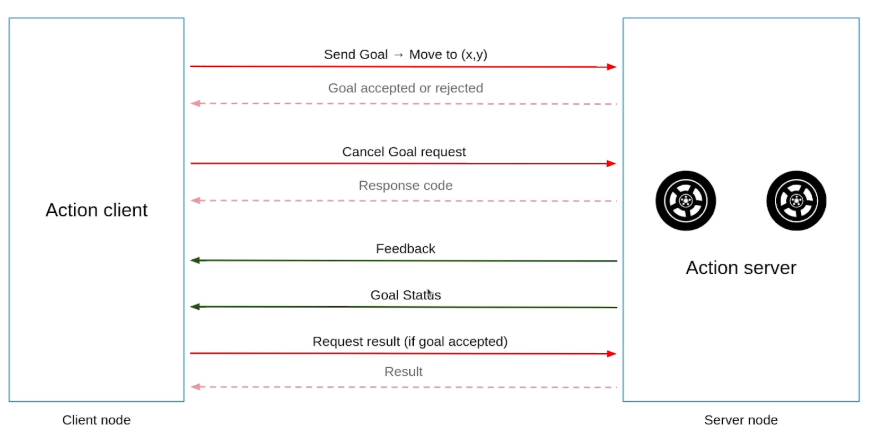
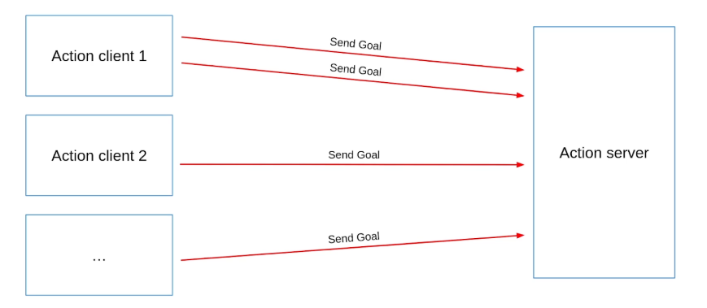

# Actions em ROS 2

## O que são Actions?

Actions são um mecanismo de comunicação assíncrona no ROS 2 usado para tarefas de **longa duração** que requerem:
- **Feedback** durante a execução
- Possibilidade de **cancelamento**
- Notificação de **resultado final**

Diferente de Services (que retornam uma resposta imediata), Actions são ideais para operações como navegação, movimentação de robôs, processamento de imagens, etc.

---

## Arquitetura de uma Action

Uma Action envolve dois componentes principais:

### Action Client (Cliente)
**Quem pede a tarefa**

- Conecta ao action server
- Envia um **goal** (objetivo)
- Recebe resposta: goal **aceito** ou **rejeitado**
- Fica ouvindo **feedback** periódico
- Recebe o **resultado final** quando a task termina
- Pode **cancelar** a execução a qualquer momento
- Pode enviar **múltiplos goals** (dependendo da política do servidor)
- Aguarda resultado de forma **assíncrona**

**Exemplo:** Cliente que solicita mover o robô para a posição (x, y)

### Action Server (Servidor)
**Quem executa a tarefa**

- Recebe o **goal**
- Decide se **aceita** ou **rejeita**
- Começa a **executar** passo a passo
- Envia **feedback** periódico (progresso, status, etc.)
- Verifica se foi **cancelado**
- Entrega o **resultado final**

**Exemplo:** Servidor que controla os motores do robô e move até a posição desejada

---

## Ciclo de Vida de uma Action



A comunicação entre Action Client e Action Server segue o seguinte fluxo:

1. **Send Goal** → Cliente envia o objetivo para o servidor
2. **Goal accepted or rejected** ← Servidor decide se aceita ou rejeita
3. **Cancel Goal request** → (Opcional) Cliente pode cancelar a execução
4. **Response code** ← Servidor confirma o cancelamento
5. **Feedback** ← Servidor envia progresso periodicamente
6. **Goal Status** ← Servidor publica o status atual do goal
7. **Request result** → Cliente requisita o resultado final
8. **Result** ← Servidor retorna o resultado

### Diagrama Sequencial Detalhado

```
Action Client                    Action Server
     |                                 |
     |------ Send Goal --------------->|
     |                                 | (recebe goal)
     |                                 |
     |<--- Goal Accepted/Rejected -----|
     |                                 | aceita?
     |                                 |   ↓
     |<------- Feedback --------------|  executa
     |<------- Feedback --------------|  envia feedback
     |<------- Feedback --------------|  verifica cancelamento
     |                                 |   ↓
     |------ Cancel Goal (opcional) -->|
     |                                 |   ↓
     |<------ Result ------------------|  conclui
     ↓                                 ↓
```

---

## Componentes Internos de uma Action

Uma action é composta por **3 serviços** e **2 tópicos**:

### Serviços (Services):
1. **Send Goal** - Envia o objetivo
2. **Cancel Goal** - Cancela a execução
3. **Get Result** - Requisita o resultado final

### Tópicos (Topics):
1. **Feedback** - Feedback periódico durante a execução
2. **Status** - Status atual do goal

> **Nota:** Não é preciso criar esses serviços e tópicos manualmente! Eles já estão implementados nas classes `ActionClient` e `ActionServer`.

---

## Criando uma Action

### Passo 1: Criar a interface da Action

No package de interfaces (ex: `my_robot_interfaces`):

```bash
cd my_robot_interfaces
mkdir action
```

### Passo 2: Definir o arquivo `.action`

Criar arquivo `action/CountUntil.action` (usar CamelCase e verbo):

```yaml
# Goal (requisição)
int64 target_number
float64 period
---
# Result (resposta final)
int64 reached_number
---
# Feedback (progresso)
int64 current_number
```

**Estrutura:**
- **Goal**: O que o cliente quer
- **Result**: O que o servidor retorna ao final
- **Feedback**: Informações periódicas durante a execução

### Passo 3: Atualizar `CMakeLists.txt`

```cmake
find_package(rosidl_default_generators REQUIRED)

rosidl_generate_interfaces(${PROJECT_NAME}
  "msg/HardwareStatus.msg"
  "srv/ComputeRectangleArea.srv"
  "action/CountUntil.action"  # Adicionar aqui
)
```

### Passo 4: Atualizar `package.xml`

```xml
<buildtool_depend>rosidl_default_generators</buildtool_depend>
<exec_depend>rosidl_default_runtime</exec_depend>
<member_of_group>rosidl_interface_packages</member_of_group>
```

### Passo 5: Compilar

```bash
cd ~/ros2_ws
colcon build --packages-select my_robot_interfaces
source install/setup.bash
```

---

## Implementando um Action Server

### Criar package para actions

```bash
cd ~/ros2_ws/src
ros2 pkg create actions_py --build-type ament_python --dependencies rclpy my_robot_interfaces
```

### Exemplo: `count_until_server.py`

```python
#!/usr/bin/env python3
import rclpy
from rclpy.node import Node
from rclpy.action import ActionServer, GoalResponse, CancelResponse
from rclpy.action.server import ServerGoalHandle
from my_robot_interfaces.action import CountUntil
import time

class CountUntilServerNode(Node):
    def __init__(self):
        super().__init__("count_until_server")
        
        self.action_server_ = ActionServer(
            self,
            CountUntil,
            "count_until",
            goal_callback=self.goal_callback,
            cancel_callback=self.cancel_callback,
            execute_callback=self.execute_callback
        )
        
        self.get_logger().info("Action server started!")
    
    def goal_callback(self, goal_request):
        """Decide se aceita ou rejeita o goal"""
        self.get_logger().info("Received a goal")
        
        # Validar o goal
        if goal_request.target_number <= 0:
            self.get_logger().warn("Rejecting goal: target must be positive")
            return GoalResponse.REJECT
        
        return GoalResponse.ACCEPT
    
    def cancel_callback(self, goal_handle):
        """Decide se aceita cancelamento"""
        self.get_logger().info("Received cancel request")
        return CancelResponse.ACCEPT
    
    def execute_callback(self, goal_handle: ServerGoalHandle):
        """Executa a tarefa"""
        self.get_logger().info("Executing goal...")
        
        # Extrair parâmetros do goal
        target_number = goal_handle.request.target_number
        period = goal_handle.request.period
        
        # Preparar feedback e result
        feedback = CountUntil.Feedback()
        result = CountUntil.Result()
        
        # Executar a tarefa
        for i in range(1, target_number + 1):
            # Verificar se foi cancelado
            if goal_handle.is_cancel_requested:
                goal_handle.canceled()
                result.reached_number = i - 1
                return result
            
            # Enviar feedback
            feedback.current_number = i
            goal_handle.publish_feedback(feedback)
            self.get_logger().info(f"Count: {i}")
            
            time.sleep(period)
        
        # Sucesso - enviar resultado
        goal_handle.succeed()
        result.reached_number = target_number
        return result

def main(args=None):
    rclpy.init(args=args)
    node = CountUntilServerNode()
    rclpy.spin(node)
    rclpy.shutdown()

if __name__ == "__main__":
    main()
```

### Máquina de Estados do Goal


O ciclo de vida de um goal no servidor segue uma máquina de estados bem definida:

**Estados Ativos (Active States):**
- **ACCEPTED** - Goal foi aceito e aguardando execução
- **EXECUTING** - Goal está sendo executado atualmente
- **CANCELING** - Goal está sendo cancelado

**Estados Terminais (Terminal States):**
- **SUCCEEDED** - Goal foi concluído com sucesso
- **CANCELED** - Goal foi cancelado com sucesso
- **ABORTED** - Goal foi abortado (erro ou nova goal com preempt)

**Transições:**
- `send_goal (accepted)` → ACCEPTED
- `execute` → EXECUTING
- `succeed` → SUCCEEDED
- `cancel_goal (accepted)` → CANCELING (de ACCEPTED ou EXECUTING)
- `canceled` → CANCELED
- `abort` → ABORTED

### Cancelamento vs Abort: Qual a diferença?

É importante entender a diferença entre **cancelar** e **abortar** um goal:

#### **Cancelamento (Cancel)**
- **Iniciado pelo Cliente**: O cliente requisita explicitamente o cancelamento
- **Controlado**: O servidor tem controle sobre quando e como parar
- **Transição**: EXECUTING → CANCELING → CANCELED
- **Resultado parcial**: Pode retornar um resultado parcial útil
- **Exemplo**: Usuário clica em "parar" na interface

```python
def execute_callback(self, goal_handle):
    for i in range(1, target + 1):
        # Verificar se o cliente pediu cancelamento
        if goal_handle.is_cancel_requested:
            goal_handle.canceled()  # Transição para CANCELED
            result.reached_number = i - 1  # Resultado parcial
            self.get_logger().info("Goal canceled by client")
            return result
        
        # ... continuar execução
```

#### **Abort (Abortar)**
- **Iniciado pelo Servidor**: O servidor decide abortar devido a erro ou condição inválida
- **Não esperado**: Geralmente indica falha ou problema
- **Transição**: EXECUTING → ABORTED
- **Erro**: Indica que algo deu errado
- **Exemplo**: Hardware falhou, parâmetros inválidos, timeout, nova goal com preempt

```python
def execute_callback(self, goal_handle):
    for i in range(1, target + 1):
        # Verificar condição de erro
        if self.battery_level < 10:
            goal_handle.abort()  # Transição para ABORTED
            result.reached_number = i - 1
            self.get_logger().error("Goal aborted: low battery!")
            return result
        
        # Verificar se hardware ainda está respondendo
        if not self.is_hardware_connected():
            goal_handle.abort()
            self.get_logger().error("Goal aborted: hardware disconnected!")
            return result
        
        # ... continuar execução
```

#### **Exemplo Completo: Tratamento de Cancelamento e Abort**

```python
def execute_callback(self, goal_handle: ServerGoalHandle):
    """Executa com tratamento de cancel e abort"""
    target = goal_handle.request.target_number
    
    feedback = CountUntil.Feedback()
    result = CountUntil.Result()
    
    for i in range(1, target + 1):
        # 1. Verificar CANCELAMENTO (requisição do cliente)
        if goal_handle.is_cancel_requested:
            goal_handle.canceled()
            result.reached_number = i - 1
            self.get_logger().warn(f"Goal canceled at {i}")
            return result
        
        # 2. Verificar condições de ABORT (erro do servidor)
        if not self.check_system_health():
            goal_handle.abort()
            result.reached_number = i - 1
            self.get_logger().error("Goal aborted: system error!")
            return result
        
        # 3. Execução normal
        feedback.current_number = i
        goal_handle.publish_feedback(feedback)
        time.sleep(1.0)
    
    # 4. Sucesso
    goal_handle.succeed()
    result.reached_number = target
    return result

def check_system_health(self):
    """Verifica se o sistema está saudável"""
    # Exemplo: verificar bateria, temperatura, conectividade, etc.
    return True  # ou False se houver problema
```

#### **Comparação Rápida**

| Aspecto | Cancel | Abort |
|---------|--------|-------|
| **Iniciado por** | Cliente | Servidor |
| **Motivo** | Usuário mudou de ideia | Erro ou falha |
| **Método** | `goal_handle.canceled()` | `goal_handle.abort()` |
| **Estado final** | CANCELED | ABORTED |
| **Resultado** | Opcional, parcial válido | Opcional, indica erro |
| **Quando usar** | Requisição explícita do usuário | Condições de erro internas |

### Executar o servidor

```bash
ros2 run actions_py count_until_server
```

---

## Implementando um Action Client

### Exemplo: `count_until_client.py`

```python
#!/usr/bin/env python3
import rclpy
from rclpy.node import Node
from rclpy.action import ActionClient
from my_robot_interfaces.action import CountUntil

class CountUntilClientNode(Node):
    def __init__(self):
        super().__init__("count_until_client")
        
        self.action_client_ = ActionClient(
            self,
            CountUntil,
            "count_until"
        )
    
    def send_goal(self, target_number, period):
        """Envia um goal para o servidor"""
        # Esperar o servidor estar disponível
        self.action_client_.wait_for_server()
        
        # Criar o goal
        goal = CountUntil.Goal()
        goal.target_number = target_number
        goal.period = period
        
        self.get_logger().info(f"Sending goal: count to {target_number}")
        
        # Enviar o goal de forma assíncrona
        self.action_client_.send_goal_async(
            goal,
            feedback_callback=self.feedback_callback
        ).add_done_callback(self.goal_response_callback)
    
    def goal_response_callback(self, future):
        """Callback quando o servidor aceita/rejeita o goal"""
        self.goal_handle_ = future.result()
        
        if not self.goal_handle_.accepted:
            self.get_logger().warn("Goal rejected!")
            return
        
        self.get_logger().info("Goal accepted!")
        
        # Aguardar o resultado
        self.goal_handle_.get_result_async().add_done_callback(
            self.goal_result_callback
        )
    
    def goal_result_callback(self, future):
        """Callback quando recebe o resultado final"""
        result = future.result().result
        status = future.result().status
        
        self.get_logger().info(f"Result: {result.reached_number} (status: {status})")
    
    def feedback_callback(self, feedback_msg):
        """Callback de feedback periódico"""
        number = feedback_msg.feedback.current_number
        self.get_logger().info(f"Feedback: {number}")

def main(args=None):
    rclpy.init(args=args)
    node = CountUntilClientNode()
    node.send_goal(10, 1.0)
    rclpy.spin(node)
    rclpy.shutdown()

if __name__ == "__main__":
    main()
```

---

## Comandos Úteis para Actions

### Listar actions disponíveis
```bash
ros2 action list
```

### Ver informações de uma action
```bash
ros2 action info /count_until
```

### Ver a interface de uma action
```bash
ros2 interface show my_robot_interfaces/action/CountUntil
```

ou

```bash
ros2 action list -t
```

### Enviar um goal pelo terminal

```bash
ros2 action send_goal /count_until my_robot_interfaces/action/CountUntil "{target_number: 4, period: 1.3}"
```

### Enviar goal com feedback visível

```bash
ros2 action send_goal /count_until my_robot_interfaces/action/CountUntil "{target_number: 4, period: 1.3}" --feedback
```

### Ver tópicos escondidos (feedback e status)

```bash
ros2 topic list --include-hidden-topics
```

### Ver services escondidos (send_goal, cancel_goal, get_result)

```bash
ros2 service list --include-hidden-services
```

---

## Políticas de Goals (Goal Policies)

Quando o servidor recebe múltiplos goals, é preciso definir como tratá-los:



Um Action Server pode receber goals de múltiplos clientes simultaneamente, e até mesmo múltiplos goals do mesmo cliente. A forma como o servidor trata esses goals depende da política implementada.

### 1. **Multiple Goals in Parallel**
Aceitar e executar múltiplos goals simultaneamente.

**Quando usar:** Tarefas independentes e não conflitantes (ex: contadores, processamento de dados)

```python
# No ActionServer, não fazer verificação de goals ativos
def goal_callback(self, goal_request):
    return GoalResponse.ACCEPT  # Sempre aceita
```

**Teste:**
```bash
# Terminal 1
ros2 run actions_py count_until_server

# Terminal 2
ros2 run actions_py count_until_client  # Goal 1

# Terminal 3
ros2 run actions_py count_until_client  # Goal 2 (executa em paralelo)
```

---

### 2. **Refuse New Goal if Current Goal is Active**
Rejeitar novos goals enquanto um está em execução.

**Quando usar:** Recursos exclusivos (ex: movimentação de um único robô)

```python
def __init__(self):
    super().__init__("action_server")
    self.current_goal_handle_ = None
    # ... resto do código

def goal_callback(self, goal_request):
    if self.current_goal_handle_ is not None and self.current_goal_handle_.is_active:
        self.get_logger().warn("A goal is already active, rejecting new goal")
        return GoalResponse.REJECT
    
    return GoalResponse.ACCEPT

def execute_callback(self, goal_handle):
    self.current_goal_handle_ = goal_handle
    # ... executar tarefa
    self.current_goal_handle_ = None
    return result
```

---

### 3. **Preempt Current Goal (Abortar meta atual)**
Cancelar o goal atual automaticamente ao receber um novo.

**Quando usar:** Priorizar sempre o comando mais recente (ex: navegação, teleoperação)

```python
def goal_callback(self, goal_request):
    # Cancelar goal atual se existir
    if self.current_goal_handle_ is not None and self.current_goal_handle_.is_active:
        self.get_logger().info("Aborting current goal and accepting new goal")
        self.current_goal_handle_.abort()
    
    return GoalResponse.ACCEPT

def execute_callback(self, goal_handle):
    self.current_goal_handle_ = goal_handle
    
    for i in range(1, target + 1):
        # Verificar se foi abortado
        if not goal_handle.is_active:
            return result
        
        # ... resto da execução
```

---

### 4. **Queue Goals (Fila de metas)**
Enfileirar goals para execução sequencial.

**Quando usar:** Tarefas que devem ser executadas em ordem (ex: pick-and-place, waypoints)

```python
from queue import Queue

def __init__(self):
    super().__init__("action_server")
    self.goal_queue_ = Queue()
    self.executing_ = False

def goal_callback(self, goal_request):
    self.get_logger().info("Goal added to queue")
    return GoalResponse.ACCEPT

def execute_callback(self, goal_handle):
    self.goal_queue_.put(goal_handle)
    
    if not self.executing_:
        self.process_queue()
    
    return CountUntil.Result()

def process_queue(self):
    self.executing_ = True
    
    while not self.goal_queue_.empty():
        goal_handle = self.goal_queue_.get()
        
        # Executar goal
        for i in range(1, goal_handle.request.target_number + 1):
            # ... execução
            pass
        
        goal_handle.succeed()
    
    self.executing_ = False
```

---

## Exemplo Completo: Move Robot

### Interface `MoveRobot.action`

```yaml
# Goal
float64 position
float64 velocity
---
# Result
float64 final_position
string message
---
# Feedback
float64 current_position
```

### Servidor Básico

```python
class MoveRobotServer(Node):
    def execute_callback(self, goal_handle):
        target_pos = goal_handle.request.position
        velocity = goal_handle.request.velocity
        
        current_pos = 0.0
        feedback = MoveRobot.Feedback()
        
        while abs(current_pos - target_pos) > 0.01:
            if goal_handle.is_cancel_requested:
                goal_handle.canceled()
                result = MoveRobot.Result()
                result.final_position = current_pos
                result.message = "Canceled"
                return result
            
            # Mover incrementalmente
            step = velocity * 0.1
            if current_pos < target_pos:
                current_pos += step
            else:
                current_pos -= step
            
            # Publicar feedback
            feedback.current_position = current_pos
            goal_handle.publish_feedback(feedback)
            
            time.sleep(0.1)
        
        # Sucesso
        goal_handle.succeed()
        result = MoveRobot.Result()
        result.final_position = current_pos
        result.message = "Success"
        return result
```

---

## Resumo

| Característica | Topic | Service | Action |
|----------------|-------|---------|--------|
| **Comunicação** | Unidirecional | Requisição/Resposta | Requisição/Feedback/Resposta |
| **Duração** | Contínua | Instantânea | Longa duração |
| **Feedback** | ❌ | ❌ | ✅ |
| **Cancelamento** | ❌ | ❌ | ✅ |
| **Exemplo** | Sensor de temperatura | Calcular área | Navegar até posição |

---

## Boas Práticas

1. ✅ Use actions para tarefas de **longa duração**
2. ✅ Sempre envie **feedback** significativo (progresso, status)
3. ✅ Implemente **cancelamento** adequadamente
4. ✅ Valide goals no `goal_callback`
5. ✅ Escolha a **goal policy** apropriada para seu caso de uso
6. ✅ Trate **exceções** no execute_callback
7. ✅ Teste com múltiplos clientes se necessário

