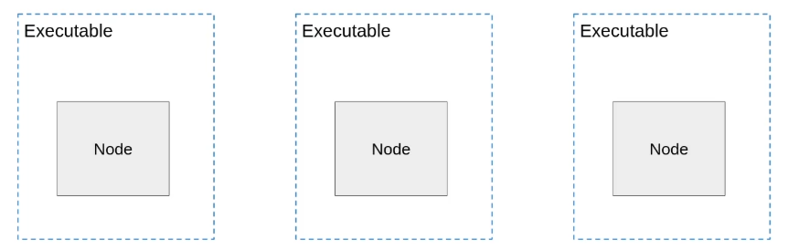
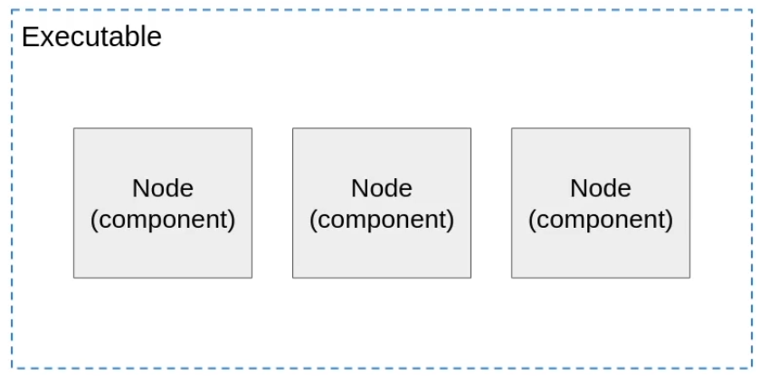

# Components (Composição de Nodes) em ROS2


No ROS2, **Components** (ou Node Composition) é uma técnica que permite executar múltiplos nodes em um único processo. Este conceito é fundamental para otimizar o desempenho de aplicações ROS2, reduzir overhead de comunicação e melhorar a eficiência geral do sistema.

---

## O que são Components?

**Components** são classes de nodes que podem ser carregadas dinamicamente e executadas no mesmo processo. Em vez de cada node rodar como um processo separado, múltiplos nodes são executados dentro de um único **container process**.

### Conceitos Chave

- **Component**: Uma classe de node que pode ser instanciada e gerenciada dinamicamente
- **Container**: Um processo que carrega e executa múltiplos components
- **Composição**: O ato de combinar múltiplos nodes em um único processo
- **Plugin**: Mecanismo usado para carregar components dinamicamente (especialmente em C++)

---

## Motivação: Por que usar Components?

### Problemas com Múltiplos Processos

Quando você executa cada node como um processo separado:

```bash
# Abordagem tradicional: cada node é um processo
ros2 run my_package node1
ros2 run my_package node2
ros2 run my_package node3
```

**Desvantagens:**
- ❌ **Overhead de comunicação**: Mesmo comunicação intra-máquina passa por DDS/middleware
- ❌ **Serialização/deserialização**: Dados precisam ser serializados e deserializados
- ❌ **Latência aumentada**: Cada mensagem passa por múltiplas camadas
- ❌ **Maior uso de memória**: Cada processo tem seu próprio espaço de memória
- ❌ **Mais recursos do sistema**: Context switching entre processos

### Vantagens dos Components

Executando múltiplos nodes no mesmo processo:

```bash
# Abordagem com components: múltiplos nodes em um processo
ros2 run my_package composed_nodes
```

**Vantagens:**
- ✅ **Zero-copy communication**: Dados podem ser passados por referência
- ✅ **Sem serialização**: Comunicação intra-processo evita overhead de serialização
- ✅ **Menor latência**: Comunicação direta na memória
- ✅ **Menos memória**: Compartilhamento de recursos dentro do processo
- ✅ **Melhor desempenho**: Menos context switching
- ✅ **Mais eficiente**: Especialmente para pipelines de processamento intensivo

### Quando Usar Components?

| Cenário | Recomendação |
|---------|-------------|
| Pipeline de processamento de imagens | ✅ Components (comunicação intensiva) |
| Nodes que trocam muitas mensagens | ✅ Components (reduz latência) |
| Sistema com recursos limitados | ✅ Components (economiza memória) |
| Nodes independentes em máquinas diferentes | ❌ Processes separados |
| Desenvolvimento/debug individual de nodes | ❌ Processes separados |
| Sistema distribuído | ❌ Processes separados |

---

## Tipos de Composição

Existem duas abordagens principais para composição de nodes:

### 1. Composição Manual (Manual Composition)

Você **explicitamente** cria instâncias dos nodes e os adiciona a um executor no código.

**Características:**
- ✅ Controle total sobre instanciação
- ✅ Simples de implementar
- ✅ Bom para casos de uso específicos
- ❌ Menos flexível (hardcoded)
- ❌ Não pode carregar dinamicamente

### 2. Composição Dinâmica (Component Registration)

Nodes são **registrados como plugins** e podem ser carregados dinamicamente em runtime.

**Características:**
- ✅ Carregamento dinâmico
- ✅ Reutilizável
- ✅ Flexível (pode mudar sem recompilar)
- ✅ Suporta container padrão do ROS2
- ❌ Mais complexo de configurar

---

## Composição Manual

A composição manual é a forma mais simples de combinar múltiplos nodes em um único processo.

### Exemplo em Python

```python
#!/usr/bin/env python3
import rclpy
from rclpy.executors import SingleThreadedExecutor
from components_py.node1 import Node1
from components_py.node2 import Node2

def main(args=None):
    rclpy.init(args=args)

    # Criar instâncias dos nodes
    node1 = Node1()
    node2 = Node2()

    # Criar um executor
    executor = SingleThreadedExecutor()
    
    # Adicionar ambos os nodes ao mesmo executor
    executor.add_node(node1)
    executor.add_node(node2)
    
    # Executar o executor (roda ambos os nodes no mesmo processo)
    executor.spin()

    rclpy.shutdown()

if __name__ == "__main__":
    main()
```

**Definição dos Nodes:**

```python
# node1.py
from rclpy.node import Node
import time

class Node1(Node):
    def __init__(self):
        super().__init__("node1")
        self.timer1_ = self.create_timer(1.0, self.callback_timer1)
        self.timer2_ = self.create_timer(1.0, self.callback_timer2)
        self.timer3_ = self.create_timer(1.0, self.callback_timer3)

    def callback_timer1(self):
        time.sleep(2.0)
        self.get_logger().info("cb 1")

    def callback_timer2(self):
        time.sleep(2.0)
        self.get_logger().info("cb 2")

    def callback_timer3(self):
        time.sleep(2.0)
        self.get_logger().info("cb 3")
```

```python
# node2.py
from rclpy.node import Node
import time

class Node2(Node):
    def __init__(self):
        super().__init__("node2")
        self.timer4_ = self.create_timer(1.0, self.callback_timer4)
        self.timer5_ = self.create_timer(1.0, self.callback_timer5)

    def callback_timer4(self):
        time.sleep(2.0)
        self.get_logger().info("cb 4")

    def callback_timer5(self):
        time.sleep(2.0)
        self.get_logger().info("cb 5")
```

### Exemplo em C++

```cpp
// manual_composition.cpp
#include "rclcpp/rclcpp.hpp"
#include "components_cpp/node1.hpp"
#include "components_cpp/node2.hpp"

int main(int argc, char **argv)
{
    rclcpp::init(argc, argv);

    // Criar um executor single-threaded
    rclcpp::executors::SingleThreadedExecutor executor;

    // Criar instâncias dos nodes
    auto node1 = std::make_shared<Node1>();
    auto node2 = std::make_shared<Node2>();

    // Adicionar os nodes ao executor
    executor.add_node(node1);
    executor.add_node(node2);

    // Executar o executor
    executor.spin();

    rclcpp::shutdown();
    return 0;
}
```

**Definição dos Nodes:**

```cpp
// node1.cpp
#include "components_cpp/node1.hpp"
#include <chrono>
#include <thread>

using namespace std::chrono_literals;

Node1::Node1() : Node("node1")
{
    this->timer1_ = this->create_wall_timer(1000ms, std::bind(&Node1::callbackTimer1, this));
    this->timer2_ = this->create_wall_timer(1000ms, std::bind(&Node1::callbackTimer2, this));
    this->timer3_ = this->create_wall_timer(1000ms, std::bind(&Node1::callbackTimer3, this));
}

void Node1::callbackTimer1()
{
    std::this_thread::sleep_for(2000ms);
    RCLCPP_INFO(this->get_logger(), "cb 1");
}

void Node1::callbackTimer2()
{
    std::this_thread::sleep_for(2000ms);
    RCLCPP_INFO(this->get_logger(), "cb 2");
}

void Node1::callbackTimer3()
{
    std::this_thread::sleep_for(2000ms);
    RCLCPP_INFO(this->get_logger(), "cb 3");
}
```

### Executando Composição Manual

```bash
# Python
ros2 run components_py manual_composition

# C++
ros2 run components_cpp manual_composition
```

**Resultado**: Node1 e Node2 executam no mesmo processo, compartilhando o mesmo executor.

---

## Componentes Registrados

Componentes registrados são nodes que podem ser carregados dinamicamente usando o sistema de plugins do ROS2. Isso é especialmente útil em C++.

### Vantagens

- ✅ **Carregamento dinâmico**: Pode carregar/descarregar components sem recompilar
- ✅ **Reutilização**: Mesmo component pode ser usado em diferentes configurações
- ✅ **Flexibilidade**: Pode mudar composição via launch files ou linha de comando
- ✅ **Component container**: Usa containers padrão do ROS2

---

## Componentes em C++

Para criar um component em C++, você precisa seguir alguns passos específicos.

### Passo 1: Modificar o Construtor

O construtor deve aceitar `rclcpp::NodeOptions`:

```cpp
// number_publisher.hpp
#ifndef COMPONENTS_CPP__NUMBER_PUBLISHER_HPP_
#define COMPONENTS_CPP__NUMBER_PUBLISHER_HPP_

#include "rclcpp/rclcpp.hpp"
#include "example_interfaces/msg/int64.hpp"

namespace my_namespace {

class NumberPublisher : public rclcpp::Node
{
public:
    // IMPORTANTE: Construtor deve aceitar NodeOptions
    NumberPublisher(const rclcpp::NodeOptions & options);

private:
    void publishNumber();
    
    int number_;
    rclcpp::Publisher<example_interfaces::msg::Int64>::SharedPtr number_publisher_;
    rclcpp::TimerBase::SharedPtr number_timer_;
};

} // namespace my_namespace

#endif
```

### Passo 2: Implementar o Component

```cpp
// number_publisher.cpp
#include "rclcpp/rclcpp.hpp"
#include "components_cpp/number_publisher.hpp"

using namespace std::chrono_literals;

namespace my_namespace {

NumberPublisher::NumberPublisher(const rclcpp::NodeOptions & options) 
    : Node("number_publisher", options)
{
    number_ = 2;

    number_publisher_ = this->create_publisher<example_interfaces::msg::Int64>("number", 10);
    number_timer_ = this->create_wall_timer(1000ms,
                                            std::bind(&NumberPublisher::publishNumber, this));
    RCLCPP_INFO(this->get_logger(), "Number publisher has been started.");
}

void NumberPublisher::publishNumber()
{
    auto msg = example_interfaces::msg::Int64();
    msg.data = number_;
    number_publisher_->publish(msg);
}

} // namespace my_namespace

// IMPORTANTE: Registrar o component
#include "rclcpp_components/register_node_macro.hpp"
RCLCPP_COMPONENTS_REGISTER_NODE(my_namespace::NumberPublisher)
```

**Pontos-Chave:**
1. ✅ Use namespace para evitar conflitos de nomes
2. ✅ Construtor aceita `const rclcpp::NodeOptions & options`
3. ✅ Passe `options` para o construtor da classe base `Node`
4. ✅ Use a macro `RCLCPP_COMPONENTS_REGISTER_NODE` para registrar o component

### Passo 3: Configurar CMakeLists.txt

```cmake
cmake_minimum_required(VERSION 3.8)
project(components_cpp)

# Encontrar dependências
find_package(ament_cmake REQUIRED)
find_package(rclcpp REQUIRED)
find_package(rclcpp_components REQUIRED)  # IMPORTANTE: Adicionar rclcpp_components
find_package(example_interfaces REQUIRED)

include_directories(include)

# Criar biblioteca compartilhada para o component
add_library(number_pub_component SHARED src/number_publisher.cpp)
ament_target_dependencies(number_pub_component rclcpp rclcpp_components example_interfaces)

# IMPORTANTE: Registrar o component
rclcpp_components_register_node(number_pub_component 
    PLUGIN "my_namespace::NumberPublisher" 
    EXECUTABLE number_publisher)

# Instalar a biblioteca
install(TARGETS 
  number_pub_component
  ARCHIVE DESTINATION lib
  LIBRARY DESTINATION lib
  RUNTIME DESTINATION bin
)

ament_package()
```

**Pontos-Chave:**
- `add_library` cria uma **biblioteca compartilhada** (SHARED)
- `rclcpp_components_register_node` registra o component
  - `PLUGIN`: Nome completo da classe (namespace::ClassName)
  - `EXECUTABLE`: Nome do executável standalone (opcional)

### Passo 4: Atualizar package.xml

```xml
<?xml version="1.0"?>
<package format="3">
  <name>components_cpp</name>
  <version>0.0.0</version>
  <description>ROS2 components example</description>
  <maintainer email="user@email.com">user</maintainer>
  <license>Apache-2.0</license>

  <buildtool_depend>ament_cmake</buildtool_depend>

  <depend>rclcpp</depend>
  <depend>rclcpp_components</depend>  <!-- IMPORTANTE: Adicionar dependência -->
  <depend>example_interfaces</depend>

  <export>
    <build_type>ament_cmake</build_type>
  </export>
</package>
```

### Passo 5: Build e Verificar

```bash
# Compilar
cd ~/ros2_ws
colcon build --packages-select components_cpp

# Source
source install/setup.bash

# Verificar se o component está registrado
ros2 component types
```

**Saída esperada:**
```
components_cpp
  my_namespace::NumberPublisher
```

---

## Componentes em Python

Python não tem o mesmo sistema de plugins que C++, mas você pode usar **manual composition** ou **entry points** para criar composições reutilizáveis.

### Abordagem com Entry Points

No `setup.py`, você pode definir entry points para diferentes composições:

```python
from setuptools import setup

package_name = 'components_py'

setup(
    name=package_name,
    version='0.0.0',
    packages=[package_name],
    data_files=[
        ('share/ament_index/resource_index/packages',
            ['resource/' + package_name]),
        ('share/' + package_name, ['package.xml']),
    ],
    install_requires=['setuptools'],
    zip_safe=True,
    maintainer='user',
    maintainer_email='user@email.com',
    description='Components example in Python',
    license='Apache-2.0',
    tests_require=['pytest'],
    entry_points={
        'console_scripts': [
            'node1 = components_py.node1:main',
            'node2 = components_py.node2:main',
            'manual_composition = components_py.manual_composition:main',
        ],
    },
)
```

### Executando

```bash
# Executar composição manual
ros2 run components_py manual_composition

# Ou executar nodes separadamente
ros2 run components_py node1
ros2 run components_py node2
```

---

## Container de Componentes

O ROS2 fornece um **component_container** padrão para carregar components dinamicamente (principalmente para C++).

### Usar Component Container Standalone

```bash
# Iniciar um container vazio
ros2 run rclcpp_components component_container

# Em outro terminal, carregar components dinamicamente
ros2 component load /ComponentManager components_cpp my_namespace::NumberPublisher

# Listar components carregados
ros2 component list

# Descarregar um component
ros2 component unload /ComponentManager 1
```

### Usar Component Container com Launch File

```python
# component_launch.py
from launch import LaunchDescription
from launch_ros.actions import ComposableNodeContainer
from launch_ros.descriptions import ComposableNode

def generate_launch_description():
    return LaunchDescription([
        ComposableNodeContainer(
            name='my_container',
            namespace='',
            package='rclcpp_components',
            executable='component_container',
            composable_node_descriptions=[
                ComposableNode(
                    package='components_cpp',
                    plugin='my_namespace::NumberPublisher',
                    name='number_publisher_1'),
                ComposableNode(
                    package='components_cpp',
                    plugin='my_namespace::NumberPublisher',
                    name='number_publisher_2'),
            ],
            output='screen',
        )
    ])
```

**Executar:**

```bash
ros2 launch my_package component_launch.py
```

**Resultado**: Ambos os components são carregados no mesmo container/processo.

---

## Comparação: Processes vs Components

### Múltiplos Processos



*Figura: Abordagem tradicional - cada node roda em seu próprio processo/executável.*

```
┌─────────────────┐     ┌─────────────────┐     ┌─────────────────┐
│   Process 1     │     │   Process 2     │     │   Process 3     │
│   ┌─────────┐   │     │   ┌─────────┐   │     │   ┌─────────┐   │
│   │ Node 1  │   │     │   │ Node 2  │   │     │   │ Node 3  │   │
│   └─────────┘   │     │   └─────────┘   │     │   └─────────┘   │
└────────┬────────┘     └────────┬────────┘     └────────┬────────┘
         │                       │                       │
         └───────────────────────┴───────────────────────┘
                            DDS/Middleware
                    (Serialização + Rede/IPC)
```

**Características:**
- Cada node em seu próprio processo
- Comunicação via DDS (serialização necessária)
- Isolamento completo (crash de um node não afeta outros)
- Mais overhead de sistema

### Composição em Single Process



*Figura: Abordagem com components - múltiplos nodes executam no mesmo processo.*

```
┌───────────────────────────────────────────────────────┐
│                  Single Process                       │
│  ┌─────────────────────────────────────────────────┐  │
│  │           Executor (SingleThreaded)             │  │
│  │  ┌─────────┐  ┌─────────┐  ┌─────────┐         │  │
│  │  │ Node 1  │  │ Node 2  │  │ Node 3  │         │  │
│  │  └─────────┘  └─────────┘  └─────────┘         │  │
│  └─────────────────────────────────────────────────┘  │
│           Intra-Process Communication                 │
│              (Zero-copy, sem serialização)            │
└───────────────────────────────────────────────────────┘
```

**Características:**
- Múltiplos nodes no mesmo processo
- Comunicação direta na memória (zero-copy possível)
- Sem serialização para comunicação intra-processo
- Menor overhead, melhor performance
- Um crash afeta todos os nodes

### Tabela Comparativa

| Aspecto | Múltiplos Processos | Components (Single Process) |
|---------|-------------------|---------------------------|
| **Latência** | Alta (DDS + serialização) | Baixa (comunicação direta) |
| **Overhead** | Alto (context switching) | Baixo (mesmo processo) |
| **Memória** | Mais (processo separado) | Menos (memória compartilhada) |
| **Isolamento** | Total (crash isolado) | Nenhum (crash afeta todos) |
| **Flexibilidade** | Alta (nodes distribuídos) | Média (mesma máquina) |
| **Debug** | Fácil (node individual) | Médio (múltiplos nodes) |
| **Zero-copy** | Não | Sim (intra-processo) |
| **Uso** | Sistemas distribuídos | Pipeline de processamento |

---

## Casos de Uso

### Quando Usar Components (Composição)

#### 1. Pipeline de Processamento de Imagens

```
Camera → Image Processor → Feature Detector → Object Tracker → Visualizer
```

**Por quê?**
- Imagens são grandes (zero-copy economiza muito)
- Alta taxa de mensagens
- Todos os nodes na mesma máquina
- Performance crítica

#### 2. Robótica de Alta Frequência

```
Sensor Fusion → State Estimator → Controller → Motor Driver
```

**Por quê?**
- Latência crítica (controle em tempo real)
- Comunicação frequente
- Todos os nodes no mesmo robô

#### 3. Sistemas Embarcados

```
GPS → IMU → Sensor Fusion → Navigation
```

**Por quê?**
- Recursos limitados (memória, CPU)
- Reduzir overhead é essencial

### Quando Usar Processos Separados

#### 1. Sistemas Distribuídos

```
Robot 1 → Network → Robot 2 → Network → Base Station
```

**Por quê?**
- Nodes em máquinas diferentes
- Comunicação via rede é necessária de qualquer forma

#### 2. Desenvolvimento e Debug

Durante desenvolvimento:
```bash
# Executar cada node separadamente para debug individual
ros2 run pkg node1
ros2 run pkg node2
```

**Por quê?**
- Fácil de debugar node individual
- Pode reiniciar um node sem afetar outros
- Logs separados

#### 3. Isolamento de Falhas

Nodes críticos vs não-críticos:
```
Critical Safety Node (separado) + Non-critical Visualization (separado)
```

**Por quê?**
- Crash do node de visualização não afeta segurança
- Isolamento de recursos

---

## Melhores Práticas

### 1. Design para Composição

**Sempre projete nodes pensando em composição:**

```cpp
// ✅ BOM: Construtor aceita NodeOptions
class MyNode : public rclcpp::Node
{
public:
    MyNode(const rclcpp::NodeOptions & options) 
        : Node("my_node", options) { }
};

// ❌ RUIM: Construtor sem NodeOptions
class MyNode : public rclcpp::Node
{
public:
    MyNode() : Node("my_node") { }  // Não pode ser usado como component
};
```

### 2. Use Namespaces em C++

**Evite conflitos de nomes:**

```cpp
// ✅ BOM: Classe dentro de namespace
namespace my_package {
    class NumberPublisher : public rclcpp::Node { };
}

// ❌ RUIM: Classe global
class NumberPublisher : public rclcpp::Node { };  // Pode conflitar
```

### 3. Ative Intra-Process Communication

Para máxima performance, ative comunicação intra-processo:

```cpp
// C++
auto options = rclcpp::NodeOptions()
    .use_intra_process_comms(true);  // Ativa zero-copy

auto node = std::make_shared<MyNode>(options);
```

```python
# Python (desde ROS2 Foxy)
node = MyNode(use_intra_process_comms=True)
```

### 4. Considere Thread Safety

Com composição, múltiplos nodes compartilham o mesmo processo:

```cpp
// ❌ RUIM: Variável global compartilhada
int shared_counter = 0;  // Race condition!

class Node1 : public rclcpp::Node {
    void callback() { shared_counter++; }  // Não thread-safe!
};
```

**Solução**: Use recursos por node ou sincronização adequada.

### 5. Use Launch Files para Flexibilidade

```python
from launch import LaunchDescription
from launch.actions import DeclareLaunchArgument
from launch.substitutions import LaunchConfiguration
from launch.conditions import IfCondition
from launch_ros.actions import ComposableNodeContainer, Node
from launch_ros.descriptions import ComposableNode

def generate_launch_description():
    use_composition = LaunchConfiguration('use_composition')

    return LaunchDescription([
        DeclareLaunchArgument(
            'use_composition',
            default_value='true',
            description='Use component composition or separate processes'
        ),
        
        # Opção 1: Composition (default)
        ComposableNodeContainer(
            condition=IfCondition(use_composition),
            name='my_container',
            namespace='',
            package='rclcpp_components',
            executable='component_container',
            composable_node_descriptions=[
                ComposableNode(
                    package='my_package',
                    plugin='my_namespace::Node1',
                    name='node1'),
                ComposableNode(
                    package='my_package',
                    plugin='my_namespace::Node2',
                    name='node2'),
            ],
        ),
        
        # Opção 2: Processos separados
        Node(
            condition=UnlessCondition(use_composition),
            package='my_package',
            executable='node1',
        ),
        Node(
            condition=UnlessCondition(use_composition),
            package='my_package',
            executable='node2',
        ),
    ])
```

**Executar:**

```bash
# Com composition
ros2 launch my_package my_launch.py use_composition:=true

# Sem composition (processos separados)
ros2 launch my_package my_launch.py use_composition:=false
```

### 6. Monitore Performance

Compare performance com e sem composition:

```bash
# Instalar ferramentas
sudo apt install ros-humble-ros2-tracing

# Medir latência
ros2 topic hz /my_topic
ros2 topic bw /my_topic

# Monitorar recursos
top
htop
```

### 7. Documente Requisitos de Composição

No README ou documentação:

```markdown
## Nodes

### my_node
- **Pode ser usado como component**: ✅ Sim
- **Requer intra-process**: ❌ Não (opcional)
- **Thread-safe**: ✅ Sim
```

---

## Resumo

### Pontos-Chave

1. **Components** permitem executar múltiplos nodes no mesmo processo
2. **Zero-copy communication** elimina overhead de serialização
3. **Composição Manual** é simples mas menos flexível
4. **Componentes Registrados** (C++) permitem carregamento dinâmico
5. **NodeOptions** no construtor é essencial para C++ components
6. **rclcpp_components** é necessário para C++ components
7. **Launch files** permitem alternar entre composition e processos separados
8. **Performance** melhora significativamente para comunicação intensiva
9. **Trade-off**: Performance vs Isolamento de falhas
10. **Design para composição** desde o início facilita uso posterior

### Decisão Rápida

```
Precisa de baixa latência e alta taxa de mensagens?
    ├─ Sim → Use Components
    └─ Não → Processos separados podem ser suficientes

Nodes estão na mesma máquina?
    ├─ Sim → Consider Components
    └─ Não → Use Processes separados

Processamento intensivo de dados grandes (imagens, point clouds)?
    ├─ Sim → Use Components (zero-copy é crucial)
    └─ Não → Processos separados são aceitáveis

Isolamento de falhas é crítico?
    ├─ Sim → Use Processes separados
    └─ Não → Components são seguros
```

### Comandos Úteis

```bash
# Verificar components registrados
ros2 component types

# Iniciar container
ros2 run rclcpp_components component_container

# Carregar component
ros2 component load /ComponentManager package_name plugin_name

# Listar components
ros2 component list

# Descarregar component
ros2 component unload /ComponentManager <component_id>
```

### Leitura Adicional

- [ROS2 Composition Documentation](https://docs.ros.org/en/humble/Tutorials/Intermediate/Composition.html)
- [Intra-Process Communication](https://docs.ros.org/en/humble/Tutorials/Demos/Intra-Process-Communication.html)
- [Component Architecture Design](https://design.ros2.org/articles/composition.html)

---

*Esta documentação foi criada como parte do repositório ROS2-study. Para mais informações, veja os outros arquivos de documentação no diretório `docs/`.*
