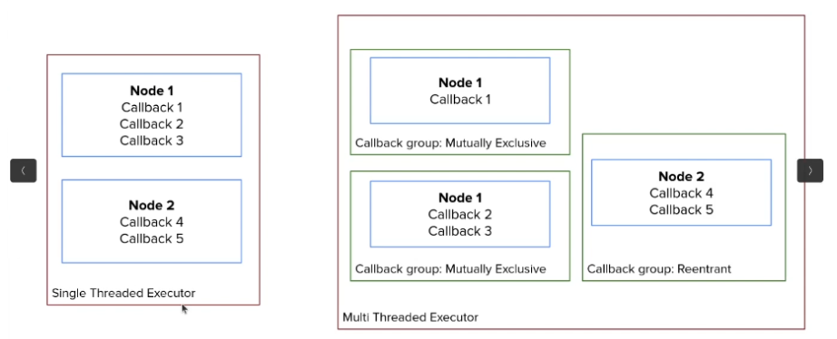

# Executors em ROS2

No ROS2, os **executors** são um componente fundamental da arquitetura rclpy/rclcpp que gerenciam a execução de nodes e seus callbacks associados. Compreender os executors é crucial para construir aplicações ROS2 eficientes, responsivas e bem estruturadas.


---

## O que são Executors?

Um **executor** no ROS2 é responsável por:
- **Gerenciar o loop de eventos** de um ou mais nodes
- **Agendar e executar callbacks** quando eventos ocorrem
- **Manipular a fila de callbacks** para garantir que os callbacks sejam processados adequadamente
- **Coordenar entre múltiplos nodes** se múltiplos nodes forem adicionados ao mesmo executor



*Figura: Um único executor pode gerenciar múltiplos nodes, coordenando a execução de todos os seus callbacks.*

### Principais Tipos de Callbacks Gerenciados pelos Executors

Os executors lidam com vários tipos de callbacks no ROS2:
1. **Timer callbacks** - Executados em intervalos especificados
2. **Subscriber callbacks** - Executados quando mensagens chegam em tópicos inscritos
3. **Service server callbacks** - Executados quando solicitações de serviço são recebidas
4. **Action server callbacks** - Executados durante o processamento de goals de actions
5. **Future callbacks** - Executados quando operações assíncronas são concluídas (ex: em clientes de service/action)

### O Executor Padrão

Quando você usa `rclpy.spin(node)` em Python ou `rclcpp::spin(node)` em C++, você está implicitamente usando um **SingleThreadedExecutor**. No entanto, você pode criar explicitamente executors para ter mais controle sobre o comportamento de execução.

```python
# SingleThreadedExecutor implícito
rclpy.spin(node)

# SingleThreadedExecutor explícito
executor = SingleThreadedExecutor()
executor.add_node(node)
executor.spin()
```

---

## Tipos de Executors

O ROS2 fornece dois tipos principais de executors:

### 1. SingleThreadedExecutor
- Executa todos os callbacks **sequencialmente em uma única thread**
- **Executor padrão** usado por `rclpy.spin()`
- Callbacks são processados **um de cada vez** na ordem FIFO
- **Sem paralelismo** - um callback deve terminar antes que o próximo comece

### 2. MultiThreadedExecutor
- Executa callbacks **em múltiplas threads**
- Permite **execução paralela** de callbacks
- Número de threads pode ser configurado (padrão: número de núcleos da CPU)
- Requer consideração cuidadosa de **thread safety** e **recursos compartilhados**

---

## Callback Groups

Os **callback groups** determinam como os callbacks dentro de um node podem ser executados em relação uns aos outros. Eles são a chave para controlar o paralelismo no ROS2.

### Tipos de Callback Groups

#### 1. MutuallyExclusiveCallbackGroup
- **Apenas um callback** no grupo pode executar por vez
- Fornece **exclusão mútua** entre callbacks no mesmo grupo
- **Callback group padrão** para todos os callbacks se não especificado
- Use quando callbacks **compartilham recursos** ou **não podem executar concorrentemente**

```python
from rclpy.callback_groups import MutuallyExclusiveCallbackGroup

cb_group = MutuallyExclusiveCallbackGroup()
self.timer = self.create_timer(1.0, self.callback, callback_group=cb_group)
```

#### 2. ReentrantCallbackGroup
- **Múltiplos callbacks** no grupo podem executar **simultaneamente**
- Permite **execução paralela** de callbacks
- Use quando callbacks são **independentes** e **thread-safe**
- Requer **MultiThreadedExecutor** para ver qualquer paralelismo

```python
from rclpy.callback_groups import ReentrantCallbackGroup

cb_group = ReentrantCallbackGroup()
self.timer1 = self.create_timer(1.0, self.callback1, callback_group=cb_group)
self.timer2 = self.create_timer(1.0, self.callback2, callback_group=cb_group)
```

### Princípio Chave: Callback Groups + Executors

| Tipo de Executor | Callback Group | Resultado |
|-----------------|----------------|----------|
| **SingleThreaded** | MutuallyExclusive | Execução sequencial (sem paralelismo) |
| **SingleThreaded** | Reentrant | Execução sequencial (sem paralelismo) |
| **MultiThreaded** | MutuallyExclusive | Execução sequencial dentro do grupo |
| **MultiThreaded** | Reentrant | **Execução paralela possível** |

**Importante**: Callback groups reentrantes apenas habilitam paralelismo quando usados com um MultiThreadedExecutor. Com um SingleThreadedExecutor, callbacks ainda executam sequencialmente independentemente do tipo de callback group.

---

## SingleThreadedExecutor

### Características

O **SingleThreadedExecutor** é o executor padrão e mais simples no ROS2.

**Comportamento:**
- Processa callbacks **um de cada vez** em uma **única thread**
- Callbacks são executados **sequencialmente** na ordem FIFO
- Se um callback demora muito tempo (operação bloqueante), **todos os outros callbacks esperam**
- Ordem de execução **previsível** e **determinística**
- **Sem complexidade de threading** ou condições de corrida

### Quando Usar SingleThreadedExecutor

✅ **Use SingleThreadedExecutor quando:**
- Sua aplicação é **simples** e não requer paralelismo
- Callbacks são **rápidos** e **não-bloqueantes**
- Você quer **execução previsível e sequencial**
- Você quer **evitar complexidade de threading**
- Seus callbacks **compartilham estado** e você quer evitar condições de corrida naturalmente

❌ **Evite SingleThreadedExecutor quando:**
- Você tem **callbacks de longa duração ou bloqueantes**
- Você precisa que **callbacks executem em paralelo**
- Você quer manter **responsividade** durante processamento pesado

### Exemplo: Problema com Callbacks Bloqueantes

Considere este cenário com callbacks bloqueantes:

```python
#!/usr/bin/env python3
import rclpy
from rclpy.node import Node
from rclpy.executors import SingleThreadedExecutor
import time

class Node1(Node):
    def __init__(self):
        super().__init__("node1")
        self.timer1_ = self.create_timer(1.0, self.callback_timer1)
        self.timer2_ = self.create_timer(1.0, self.callback_timer2)
        self.timer3_ = self.create_timer(1.0, self.callback_timer3)

    def callback_timer1(self):
        time.sleep(2.0)  # Simulates blocking operation
        self.get_logger().info("cb 1")

    def callback_timer2(self):
        time.sleep(2.0)  # Simulates blocking operation
        self.get_logger().info("cb 2")

    def callback_timer3(self):
        time.sleep(2.0)  # Simulates blocking operation
        self.get_logger().info("cb 3")

class Node2(Node):
    def __init__(self):
        super().__init__("node2")
        self.timer4_ = self.create_timer(1.0, self.callback_timer4)
        self.timer5_ = self.create_timer(1.0, self.callback_timer5)

    def callback_timer4(self):
        time.sleep(2.0)  # Simulates blocking operation
        self.get_logger().info("cb 4")

    def callback_timer5(self):
        time.sleep(2.0)  # Simulates blocking operation
        self.get_logger().info("cb 5")

def main(args=None):
    rclpy.init(args=args)
    node1 = Node1()
    node2 = Node2()

    executor = SingleThreadedExecutor()
    executor.add_node(node1)
    executor.add_node(node2)
    executor.spin()

    rclpy.shutdown()

if __name__ == "__main__":
    main()
```

**Comportamento Esperado:**
- Cada timer dispara a cada 1 segundo
- Mas cada callback leva 2 segundos para completar (`time.sleep(2.0)`)
- Com **SingleThreadedExecutor**, callbacks executam **sequencialmente**

**Linha do Tempo de Execução:**
```
t=0s:   cb1 inicia (bloqueia por 2s)
t=2s:   cb1 termina, cb2 inicia (bloqueia por 2s)
t=4s:   cb2 termina, cb3 inicia (bloqueia por 2s)
t=6s:   cb3 termina, cb4 inicia (bloqueia por 2s)
t=8s:   cb4 termina, cb5 inicia (bloqueia por 2s)
t=10s:  cb5 termina, então o ciclo se repete...
```

**Problema**: Mesmo que os timers estejam configurados para disparar a cada 1 segundo, cada callback deve esperar que todos os callbacks anteriores completem. Isso cria **atrasos significativos** e reduz a **responsividade**.

---

## MultiThreadedExecutor

### Características

O **MultiThreadedExecutor** permite que callbacks executem em **paralelo através de múltiplas threads**.

**Comportamento:**
- Cria um **pool de threads** (padrão: número de núcleos da CPU)
- Callbacks podem executar **simultaneamente** em threads diferentes
- Respeita **restrições de callback group** (MutuallyExclusive vs Reentrant)
- Habilita **melhor responsividade** e **latência reduzida**
- Introduz **complexidade de threading** (condições de corrida, deadlocks, etc.)

### Quando Usar MultiThreadedExecutor

✅ **Use MultiThreadedExecutor quando:**
- Você tem **callbacks de longa duração ou bloqueantes**
- Você precisa que **callbacks executem em paralelo**
- Você quer **manter responsividade** durante processamento pesado
- Você tem **callbacks independentes** que não compartilham estado
- Sua aplicação se beneficia de **execução concorrente**

⚠️ **Tenha cuidado com MultiThreadedExecutor quando:**
- Callbacks **compartilham estado mutável** (use sincronização apropriada)
- Você não está familiarizado com **conceitos de threading** (condições de corrida, deadlocks)
- Seus callbacks acessam **recursos não thread-safe**

### Exemplo: Responsividade Melhorada com MultiThreadedExecutor

Usando os mesmos callbacks bloqueantes de antes, mas com MultiThreadedExecutor:

```python
#!/usr/bin/env python3
import rclpy
from rclpy.node import Node
from rclpy.executors import MultiThreadedExecutor
from rclpy.callback_groups import ReentrantCallbackGroup, MutuallyExclusiveCallbackGroup
import time

class Node1(Node):
    def __init__(self):
        super().__init__("node1")
        
        # Option 1: All callbacks in a ReentrantCallbackGroup (full parallelism)
        # self.cb_group_ = ReentrantCallbackGroup()
        # self.timer1_ = self.create_timer(1.0, self.callback_timer1, callback_group=self.cb_group_)
        # self.timer2_ = self.create_timer(1.0, self.callback_timer2, callback_group=self.cb_group_)
        # self.timer3_ = self.create_timer(1.0, self.callback_timer3, callback_group=self.cb_group_)
        
        # Option 2: Fine-grained control with multiple callback groups
        self.cb_group1_ = MutuallyExclusiveCallbackGroup()  # cb1 runs exclusively
        self.cb_group2_ = MutuallyExclusiveCallbackGroup()  # cb2 and cb3 are mutually exclusive
        
        self.timer1_ = self.create_timer(1.0, self.callback_timer1, callback_group=self.cb_group1_)
        self.timer2_ = self.create_timer(1.0, self.callback_timer2, callback_group=self.cb_group2_)
        self.timer3_ = self.create_timer(1.0, self.callback_timer3, callback_group=self.cb_group2_)

    def callback_timer1(self):
        time.sleep(2.0)
        self.get_logger().info("cb 1")

    def callback_timer2(self):
        time.sleep(2.0)
        self.get_logger().info("cb 2")

    def callback_timer3(self):
        time.sleep(2.0)
        self.get_logger().info("cb 3")

class Node2(Node):
    def __init__(self):
        super().__init__("node2")
        
        # ReentrantCallbackGroup allows cb4 and cb5 to run in parallel
        self.cb_group_ = ReentrantCallbackGroup()
        
        self.timer4_ = self.create_timer(1.0, self.callback_timer4, callback_group=self.cb_group_)
        self.timer5_ = self.create_timer(1.0, self.callback_timer5)

    def callback_timer4(self):
        time.sleep(2.0)
        self.get_logger().info("cb 4")

    def callback_timer5(self):
        time.sleep(2.0)
        self.get_logger().info("cb 5")

def main(args=None):
    rclpy.init(args=args)
    node1 = Node1()
    node2 = Node2()

    executor = MultiThreadedExecutor()
    executor.add_node(node1)
    executor.add_node(node2)
    executor.spin()

    rclpy.shutdown()

if __name__ == "__main__":
    main()
```

**Com MultiThreadedExecutor e ReentrantCallbackGroup:**

**Linha do Tempo de Execução** (assumindo threads suficientes):
```
t=0s:   cb1, cb2, cb3, cb4, cb5 todos iniciam em paralelo (cada um bloqueia por 2s)
t=2s:   Todos os callbacks terminam simultaneamente
t=2s:   Próximo ciclo começa imediatamente
```

**Resultado**: Todos os callbacks executam **em paralelo**, reduzindo drasticamente o tempo total de execução de 10 segundos para 2 segundos por ciclo.

**Com MutuallyExclusiveCallbackGroup** (como no código acima):
- `cb1` executa independentemente
- `cb2` e `cb3` são mutuamente exclusivos (um por vez)
- `cb4` e `cb5` podem executar em paralelo (cb5 usa o grupo padrão que é separado)

Isso fornece **controle refinado** sobre quais callbacks podem executar concorrentemente.

---

## Framework de Decisão

Escolher o executor correto e a configuração de callback group depende dos requisitos da sua aplicação. Use este framework de decisão:

### Passo 1: Analise Seus Callbacks

Faça estas perguntas sobre cada callback:

1. **Duração**: O callback é rápido (<1ms) ou lento (>100ms)?
2. **Bloqueio**: O callback bloqueia (I/O, sleep, espera)?
3. **Estado Compartilhado**: O callback acessa recursos compartilhados?
4. **Independência**: Este callback pode executar concorrentemente com outros?

### Passo 2: Escolha o Tipo de Executor

```
┌─────────────────────────────────────────────────────┐
│ Você tem callbacks de longa duração ou bloqueantes?│
└─────────────────┬───────────────────────────────────┘
                  │
        ┌─────────┴─────────┐
        │                   │
       SIM                 NÃO
        │                   │
        v                   v
   MultiThreaded      SingleThreaded
   Executor           Executor
```

**SingleThreadedExecutor se:**
- ✅ Todos os callbacks são rápidos (<1ms tipicamente)
- ✅ Sem operações bloqueantes
- ✅ Execução simples e previsível é desejada
- ✅ Você quer evitar complexidade de threading

**MultiThreadedExecutor se:**
- ✅ Qualquer callback é lento ou bloqueante
- ✅ Você precisa de execução concorrente de callbacks
- ✅ Você quer manter responsividade durante processamento
- ✅ Você está confortável com conceitos de threading

### Passo 3: Escolha os Callback Groups

```
┌─────────────────────────────────────────────────────┐
│ Estes callbacks compartilham estado/recursos        │
│ mutáveis?                                           │
└─────────────────┬───────────────────────────────────┘
                  │
        ┌─────────┴─────────┐
        │                   │
       SIM                 NÃO
        │                   │
        v                   v
  MutuallyExclusive    Reentrant
  CallbackGroup        CallbackGroup
```

**MutuallyExclusiveCallbackGroup se:**
- ✅ Callbacks compartilham estado mutável (variáveis, objetos)
- ✅ Callbacks acessam recursos não thread-safe
- ✅ Ordem de execução importa
- ✅ Você quer prevenir condições de corrida naturalmente

**ReentrantCallbackGroup se:**
- ✅ Callbacks são completamente independentes
- ✅ Sem estado compartilhado entre callbacks
- ✅ Todos os recursos acessados são thread-safe
- ✅ Paralelismo máximo é desejado

### Passo 4: Padrões Comuns

| Caso de Uso | Executor | Callback Group | Justificativa |
|-------------|----------|----------------|---------------|
| Publisher/subscriber simples | SingleThreaded | Padrão (MutuallyExclusive) | Operações rápidas e não-bloqueantes |
| Service server com computação pesada | MultiThreaded | ReentrantCallbackGroup | Permite múltiplas requisições em paralelo |
| Action server | MultiThreaded | MutuallyExclusiveCallbackGroup | Gerencia estado do goal com segurança |
| Múltiplos timers independentes | MultiThreaded | ReentrantCallbackGroup | Timers podem executar concorrentemente |
| Timers compartilhando estado da classe | MultiThreaded | MutuallyExclusiveCallbackGroup | Previne condições de corrida |
| Pipeline de processamento de câmera | MultiThreaded | Grupos separados por estágio | Paralelismo de pipeline |

---

## Exemplos Práticos

### Exemplo 1: Publisher Simples (SingleThreadedExecutor)

```python
#!/usr/bin/env python3
import rclpy
from rclpy.node import Node
from rclpy.executors import SingleThreadedExecutor
from example_interfaces.msg import Int64

class NumberPublisherNode(Node):
    def __init__(self):
        super().__init__("number_publisher")
        self.number_ = 1
        self.publish_frequency_ = 1.0
        self.number_publisher_ = self.create_publisher(Int64, "number", 10)
        self.number_timer_ = self.create_timer(
            1.0 / self.publish_frequency_, self.publish_number)
        self.get_logger().info("Number publisher has been started.")

    def publish_number(self):
        msg = Int64()
        msg.data = self.number_
        self.number_publisher_.publish(msg)
        self.number_ += 1

def main(args=None):
    rclpy.init(args=args)
    node = NumberPublisherNode()
    
    # Traditional way: implicit SingleThreadedExecutor
    # rclpy.spin(node)
    
    # Explicit way: create SingleThreadedExecutor
    executor = SingleThreadedExecutor()
    executor.add_node(node)
    executor.spin()
    
    rclpy.shutdown()

if __name__ == "__main__":
    main()
```

**Análise:**
- ✅ Callback rápido e não-bloqueante (apenas publicando uma mensagem)
- ✅ SingleThreadedExecutor é perfeito para este caso de uso
- ✅ Sem necessidade de complexidade de threading

### Exemplo 2: Processamento Paralelo (MultiThreadedExecutor + ReentrantCallbackGroup)

```python
#!/usr/bin/env python3
import rclpy
from rclpy.node import Node
from rclpy.executors import MultiThreadedExecutor
from rclpy.callback_groups import ReentrantCallbackGroup
import time

class ImageProcessorNode(Node):
    def __init__(self):
        super().__init__("image_processor")
        
        # Create ReentrantCallbackGroup for parallel processing
        self.cb_group_ = ReentrantCallbackGroup()
        
        # Multiple image processing pipelines can run in parallel
        self.timer1_ = self.create_timer(0.1, self.process_camera1, callback_group=self.cb_group_)
        self.timer2_ = self.create_timer(0.1, self.process_camera2, callback_group=self.cb_group_)
        self.timer3_ = self.create_timer(0.1, self.process_camera3, callback_group=self.cb_group_)
        
        self.get_logger().info("Image processor started")

    def process_camera1(self):
        # Simulate heavy image processing
        time.sleep(0.5)  # In reality, this would be actual processing
        self.get_logger().info("Camera 1 processed")

    def process_camera2(self):
        time.sleep(0.5)
        self.get_logger().info("Camera 2 processed")

    def process_camera3(self):
        time.sleep(0.5)
        self.get_logger().info("Camera 3 processed")

def main(args=None):
    rclpy.init(args=args)
    node = ImageProcessorNode()
    
    # MultiThreadedExecutor allows parallel processing
    executor = MultiThreadedExecutor(num_threads=4)
    executor.add_node(node)
    executor.spin()
    
    rclpy.shutdown()

if __name__ == "__main__":
    main()
```

**Análise:**
- ✅ Callbacks de longa duração (0.5s cada)
- ✅ Processamento independente (sem estado compartilhado)
- ✅ MultiThreadedExecutor + ReentrantCallbackGroup habilita paralelismo
- ✅ Todas as três câmeras podem ser processadas simultaneamente

### Exemplo 3: Proteção de Estado Compartilhado (MultiThreadedExecutor + MutuallyExclusiveCallbackGroup)

```python
#!/usr/bin/env python3
import rclpy
from rclpy.node import Node
from rclpy.executors import MultiThreadedExecutor
from rclpy.callback_groups import MutuallyExclusiveCallbackGroup, ReentrantCallbackGroup
from example_interfaces.msg import Int64

class CounterNode(Node):
    def __init__(self):
        super().__init__("counter")
        
        # Shared state that needs protection
        self.counter_ = 0
        
        # MutuallyExclusive for callbacks that modify shared state
        self.counter_group_ = MutuallyExclusiveCallbackGroup()
        
        # These timers share the counter, so they must be mutually exclusive
        self.increment_timer_ = self.create_timer(
            0.1, self.increment_counter, callback_group=self.counter_group_)
        self.decrement_timer_ = self.create_timer(
            0.15, self.decrement_counter, callback_group=self.counter_group_)
        
        # Reentrant group for independent publishing (can run in parallel)
        self.publish_group_ = ReentrantCallbackGroup()
        
        self.publisher_ = self.create_publisher(Int64, "counter_value", 10)
        self.publish_timer_ = self.create_timer(
            0.5, self.publish_counter, callback_group=self.publish_group_)

    def increment_counter(self):
        # Safe because MutuallyExclusive guarantees no concurrent access
        self.counter_ += 1
        self.get_logger().info(f"Incremented: {self.counter_}")

    def decrement_counter(self):
        # Safe because MutuallyExclusive guarantees no concurrent access
        self.counter_ -= 1
        self.get_logger().info(f"Decremented: {self.counter_}")

    def publish_counter(self):
        # Can run in parallel with increment/decrement from different group
        msg = Int64()
        msg.data = self.counter_
        self.publisher_.publish(msg)
        self.get_logger().info(f"Published: {self.counter_}")

def main(args=None):
    rclpy.init(args=args)
    node = CounterNode()
    
    executor = MultiThreadedExecutor()
    executor.add_node(node)
    executor.spin()
    
    rclpy.shutdown()

if __name__ == "__main__":
    main()
```

**Análise:**
- ✅ `increment_counter` e `decrement_counter` compartilham estado (`self.counter_`)
- ✅ MutuallyExclusiveCallbackGroup previne condições de corrida
- ✅ `publish_counter` é independente e pode executar em paralelo
- ✅ Controle refinado com múltiplos callback groups

---

## Integração com Outros Conceitos do ROS2

### Executors e Actions

Actions no ROS2 envolvem múltiplos callbacks:
- Callback de requisição de goal
- Callback de requisição de cancelamento
- Callback de execução (longa duração)

**Recomendação**: Use **MultiThreadedExecutor** com actions para manter responsividade.

```python
from rclpy.action import ActionServer
from rclpy.callback_groups import ReentrantCallbackGroup

class MyActionServer(Node):
    def __init__(self):
        super().__init__("my_action_server")
        
        # Reentrant group allows multiple goals to execute in parallel
        self.action_group_ = ReentrantCallbackGroup()
        
        self.action_server_ = ActionServer(
            self,
            MyAction,
            'my_action',
            self.execute_callback,
            callback_group=self.action_group_
        )

    def execute_callback(self, goal_handle):
        # Long-running action execution
        # Can run in parallel with other goals
        pass
```

**Por quê?**
- Callbacks de execução de actions são tipicamente **de longa duração**
- Você pode querer **aceitar múltiplos goals concorrentemente**
- MultiThreadedExecutor + ReentrantCallbackGroup habilita isso

### Executors e Lifecycle Nodes

Lifecycle nodes envolvem callbacks de transição de estado:
- `on_configure()`
- `on_activate()`
- `on_deactivate()`
- `on_cleanup()`
- `on_shutdown()`

**Recomendação**: Tipicamente **SingleThreadedExecutor** é suficiente.

```python
from rclpy.lifecycle import LifecycleNode

class MyLifecycleNode(LifecycleNode):
    def __init__(self):
        super().__init__("my_lifecycle_node")
    
    def on_configure(self, state):
        # Configuration logic
        return TransitionCallbackReturn.SUCCESS
    
    def on_activate(self, state):
        # Activation logic
        return TransitionCallbackReturn.SUCCESS
```

**Por quê?**
- Transições de lifecycle são tipicamente **sequenciais** e **dependentes de estado**
- Callbacks de transição são geralmente **rápidos**
- Sem benefício de paralelismo; simplicidade é preferida

### Executors e Services

Service servers podem se beneficiar de MultiThreadedExecutor:

```python
from example_interfaces.srv import AddTwoInts
from rclpy.callback_groups import ReentrantCallbackGroup

class CalculatorService(Node):
    def __init__(self):
        super().__init__("calculator")
        
        # Allow multiple service requests in parallel
        self.service_group_ = ReentrantCallbackGroup()
        
        self.service_ = self.create_service(
            AddTwoInts,
            'add_two_ints',
            self.add_callback,
            callback_group=self.service_group_
        )

    def add_callback(self, request, response):
        # Heavy computation
        time.sleep(1.0)  # Simulate processing
        response.sum = request.a + request.b
        return response
```

**Por quê?**
- Callbacks de service podem envolver **computação pesada**
- MultiThreadedExecutor permite que **múltiplos clientes** sejam atendidos concorrentemente
- Sem ele, clientes devem esperar sequencialmente

---

## Melhores Práticas

### 1. Comece com SingleThreadedExecutor

**Simplifique por padrão**: Comece com SingleThreadedExecutor e apenas mude para MultiThreadedExecutor se encontrar problemas de responsividade.

```python
# Comece simples
executor = SingleThreadedExecutor()

# Atualize apenas se necessário
# executor = MultiThreadedExecutor()
```

### 2. Use Callback Groups Intencionalmente

**Não abuse de ReentrantCallbackGroup**: Use apenas quando callbacks são verdadeiramente independentes e thread-safe.

```python
# ❌ RUIM: Compartilhando estado com ReentrantCallbackGroup
self.shared_data = []
self.cb_group = ReentrantCallbackGroup()
self.timer1 = self.create_timer(1.0, self.modify_data, callback_group=self.cb_group)
self.timer2 = self.create_timer(1.0, self.modify_data, callback_group=self.cb_group)
# Condição de corrida! Ambos callbacks podem executar simultaneamente e corromper shared_data

# ✅ BOM: Use MutuallyExclusiveCallbackGroup para estado compartilhado
self.shared_data = []
self.cb_group = MutuallyExclusiveCallbackGroup()
self.timer1 = self.create_timer(1.0, self.modify_data, callback_group=self.cb_group)
self.timer2 = self.create_timer(1.0, self.modify_data, callback_group=self.cb_group)
# Seguro! Apenas um callback executa por vez
```

### 3. Evite Operações Bloqueantes em Callbacks

**Minimize bloqueio**: Mesmo com MultiThreadedExecutor, evite bloqueios desnecessários.

```python
# ❌ RUIM: Sleep bloqueante no callback
def callback(self):
    time.sleep(5.0)  # Bloqueia thread por 5 segundos
    self.process_data()

# ✅ MELHOR: Use operações assíncronas ou delegue para thread separada
def callback(self):
    # Abordagem não-bloqueante
    self.executor.create_task(self.async_process_data())
```

### 4. Configure o Número Apropriado de Threads

**Configure threads baseado na carga de trabalho**:

```python
# Padrão: número de núcleos da CPU
executor = MultiThreadedExecutor()

# Personalizado: baseado em callbacks concorrentes esperados
executor = MultiThreadedExecutor(num_threads=8)
```

**Orientação**: 
- Configure `num_threads` ≈ número de **callbacks bloqueantes concorrentes** esperados
- Mais threads nem sempre é melhor (overhead de troca de contexto)

### 5. Seja Cauteloso com Recursos Compartilhados

**Thread safety é sua responsabilidade**:

```python
# ❌ RUIM: Condição de corrida
class UnsafeNode(Node):
    def __init__(self):
        super().__init__("unsafe")
        self.cb_group = ReentrantCallbackGroup()
        self.counter = 0
        self.timer1 = self.create_timer(0.1, self.increment, callback_group=self.cb_group)
        self.timer2 = self.create_timer(0.1, self.increment, callback_group=self.cb_group)
    
    def increment(self):
        temp = self.counter
        time.sleep(0.01)  # Simula processamento
        self.counter = temp + 1  # CONDIÇÃO DE CORRIDA!

# ✅ BOM: Use locks ou MutuallyExclusive
import threading

class SafeNode(Node):
    def __init__(self):
        super().__init__("safe")
        self.cb_group = ReentrantCallbackGroup()
        self.counter = 0
        self.lock = threading.Lock()
        self.timer1 = self.create_timer(0.1, self.increment, callback_group=self.cb_group)
        self.timer2 = self.create_timer(0.1, self.increment, callback_group=self.cb_group)
    
    def increment(self):
        with self.lock:
            temp = self.counter
            time.sleep(0.01)
            self.counter = temp + 1  # Seguro!
```

### 6. Teste com Carga

**Verifique comportamento sob carga**:

```bash
# Teste com múltiplas requisições concorrentes
ros2 service call /my_service example_interfaces/srv/Trigger &
ros2 service call /my_service example_interfaces/srv/Trigger &
ros2 service call /my_service example_interfaces/srv/Trigger &
```

Monitore por:
- Tempos de resposta
- Deadlocks
- Condições de corrida
- Vazamentos de recursos

### 7. Documente Requisitos de Executor

**Seja explícito em seu código**:

```python
def main(args=None):
    rclpy.init(args=args)
    node = MyNode()
    
    # IMPORTANTE: Este node requer MultiThreadedExecutor
    # porque callbacks envolvem processamento pesado de imagens
    executor = MultiThreadedExecutor(num_threads=4)
    executor.add_node(node)
    executor.spin()
    
    rclpy.shutdown()
```

---

## Resumo

### Tabela de Referência Rápida

| Cenário | Executor | Callback Group | Explicação |
|----------|----------|----------------|-------------|
| Pub/sub simples | Single | Padrão | Operações rápidas e não-bloqueantes |
| Computação longa | Multi | Reentrant | Habilita paralelismo para tarefas independentes |
| Estado compartilhado | Multi | MutuallyExclusive | Previne condições de corrida |
| Action server | Multi | Reentrant | Permite execução concorrente de goals |
| Service server (rápido) | Single | Padrão | Processamento sequencial simples |
| Service server (lento) | Multi | Reentrant | Serve múltiplos clientes concorrentemente |
| Lifecycle node | Single | Padrão | Transições de estado sequenciais |
| Múltiplos nodes independentes | Multi | Reentrant | Maximiza paralelismo |

### Pontos-Chave

1. **Executors** gerenciam a execução de callbacks no ROS2
2. **SingleThreadedExecutor** é o padrão: simples, sequencial, previsível
3. **MultiThreadedExecutor** habilita paralelismo mas requer cuidado com thread safety
4. **MutuallyExclusiveCallbackGroup** garante um callback por vez (previne condições de corrida)
5. **ReentrantCallbackGroup** permite execução paralela (requer thread safety)
6. **Framework de Decisão**: Analise duração do callback, bloqueio, estado compartilhado e independência
7. **Comece simples**: Use SingleThreadedExecutor por padrão, atualize apenas se necessário
8. **Thread safety é sua responsabilidade** ao usar MultiThreadedExecutor com estado compartilhado

### Leitura Adicional

- [Documentação de Executors do ROS2](https://docs.ros.org/en/humble/Concepts/About-Executors.html)
- [Callback Groups do ROS2](https://docs.ros.org/en/humble/How-To-Guides/Using-callback-groups.html)

