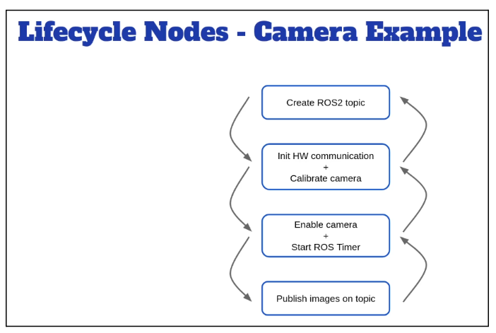
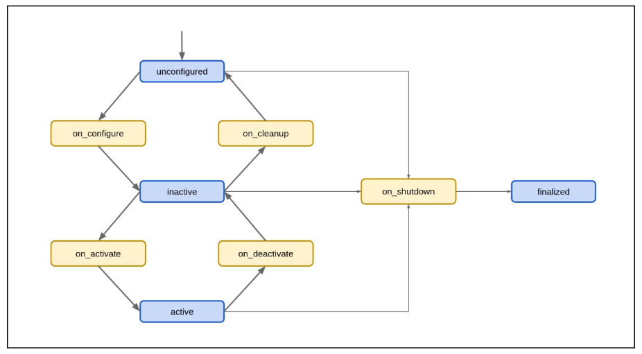
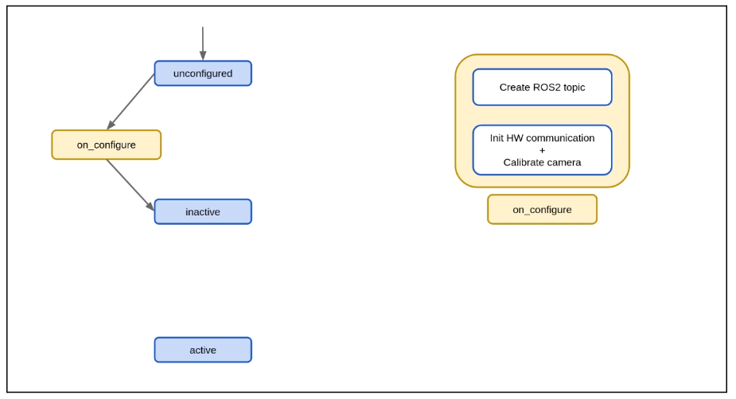
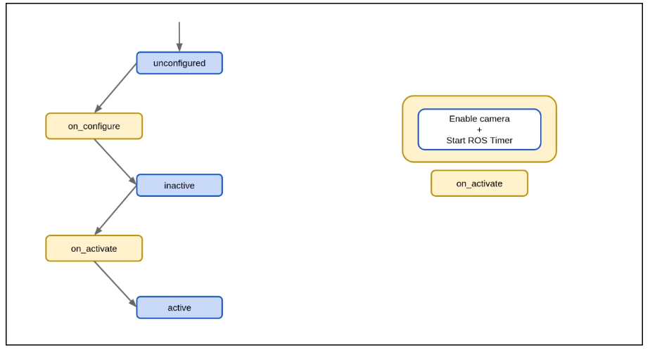
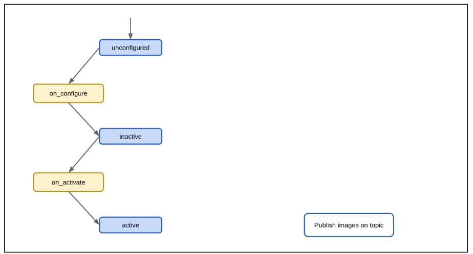
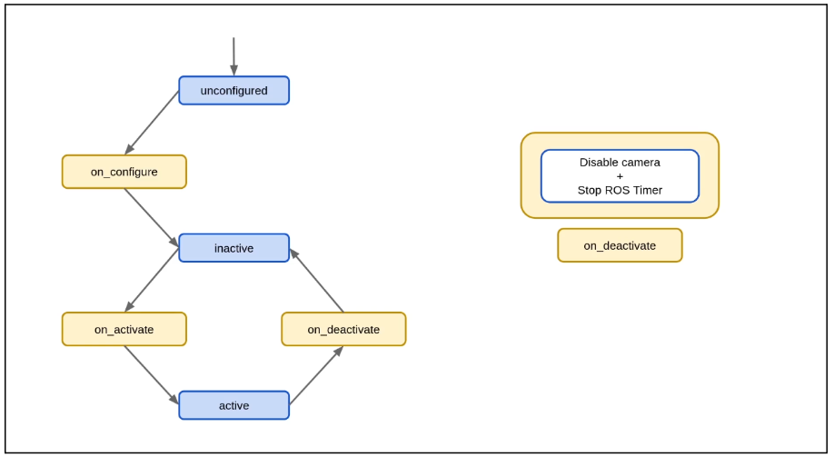
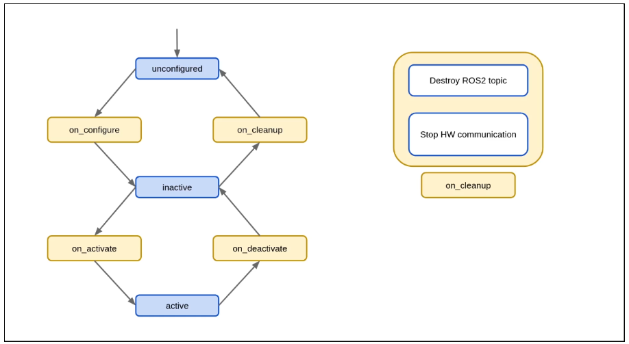
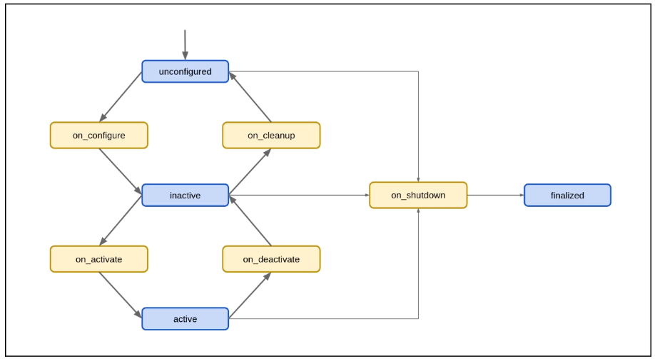

# Lifecycle Nodes em ROS 2

## O que são Lifecycle Nodes?

**Lifecycle Nodes** (Nós com Ciclo de Vida) são nós especiais no ROS 2 que possuem estados bem definidos e transições controladas. Diferente de nós normais que iniciam imediatamente após serem executados, lifecycle nodes permitem um **controle fino sobre quando e como um nó inicia, pausa e finaliza** suas operações.

### Por que usar Lifecycle Nodes?

1. **Inicialização controlada** - Configure recursos antes de ativar o nó
2. **Shutdown gracioso** - Libere recursos de forma ordenada
3. **Reconfiguração sem reiniciar** - Mude configurações sem matar o processo
4. **Gerenciamento de sistemas complexos** - Controle a ordem de inicialização de múltiplos nós
5. **Recuperação de erros** - Desative temporariamente nós com problemas
6. **Hot-swapping** - Substitua componentes sem derrubar o sistema

**Exemplos de uso:**
- Robôs móveis: inicializar sensores → calibrar → ativar navegação
- Sistemas de visão: carregar modelos → configurar câmera → iniciar detecção
- Manipuladores: home position → check sensors → enable motors

### Exemplo Prático: Camera Driver Node



Considere um nó que controla uma câmera:

1. **Unconfigured** → Nó existe mas câmera não está inicializada
2. **Configure** → Conecta à câmera, aloca buffer de imagens, cria publisher
3. **Inactive** → Câmera conectada mas não capturando imagens
4. **Activate** → Inicia captura e publicação de imagens
5. **Active** → Publicando imagens continuamente
6. **Deactivate** → Para captura mas mantém conexão
7. **Cleanup** → Desconecta câmera, libera buffers
8. **Shutdown** → Finaliza completamente

---

## Estados do Lifecycle Node

Um lifecycle node possui **4 estados primários** e **4 estados de transição**:

### Estados Primários (Primary States)

```
┌─────────────┐
│ Unconfigured│ ◄─── Estado inicial
└──────┬──────┘
       │ configure
       ▼
┌─────────────┐
│  Inactive   │ ◄─── Configurado mas não ativo
└──────┬──────┘
       │ activate
       ▼
┌─────────────┐
│   Active    │ ◄─── Executando normalmente
└──────┬──────┘
       │ deactivate
       ▼
┌─────────────┐
│  Inactive   │
└──────┬──────┘
       │ cleanup
       ▼
┌─────────────┐
│ Unconfigured│
└─────────────┘
       │ shutdown
       ▼
┌─────────────┐
│  Finalized  │ ◄─── Estado final (não pode sair)
└─────────────┘
```

#### 1. **Unconfigured** (Não Configurado)
- Estado inicial após o nó ser criado
- Nó existe mas não faz nada
- Comunicações ROS2 ainda não criadas (publishers, subscribers, etc.)

#### 2. **Inactive** (Inativo)
- Nó está configurado mas não operacional
- Comunicações ROS2 criadas mas não publicam/processam
- Recursos alocados mas não utilizados
- Pronto para ser ativado rapidamente

#### 3. **Active** (Ativo)
- Nó está totalmente operacional
- Publishers publicam, subscribers processam mensagens
- Funcionalidade completa

#### 4. **Finalized** (Finalizado)
- Estado terminal
- Nó foi desligado completamente
- Não pode mais ser usado (precisa ser recriado)

### Estados de Transição (Transition States)

Durante as mudanças de estado, o nó passa por estados intermediários:

- **Configuring** - Entre Unconfigured → Inactive
- **CleaningUp** - Entre Inactive → Unconfigured
- **Activating** - Entre Inactive → Active
- **Deactivating** - Entre Active → Inactive
- **ShuttingDown** - Indo para Finalized
- **ErrorProcessing** - Quando ocorre erro em transição

---

## Diagramas de Estados

### Máquina de Estados (ROS 2 Documentation)


### Máquina de Estados Detalhada



### Diagrama ASCII Completo

```
                    ┌───────────────────┐
                    │   Unconfigured    │◄──── Estado inicial
                    └─────────┬─────────┘
                              │
                    ┌─────────▼─────────┐
                    │   on_configure()  │
                    │   (Configuring)   │
                    └─────────┬─────────┘
                              │
                    ┌─────────▼─────────┐
                    │     Inactive      │
                    └───┬───────────┬───┘
                        │           │
              activate  │           │  cleanup
                        │           │
            ┌───────────▼───┐   ┌───▼──────────┐
            │ on_activate() │   │ on_cleanup() │
            │ (Activating)  │   │(CleaningUp)  │
            └───────┬───────┘   └───┬──────────┘
                    │               │
            ┌───────▼───────┐       │
            │    Active     │       │
            └───────┬───────┘       │
                    │               │
          deactivate│               │
                    │               │
        ┌───────────▼─────┐         │
        │ on_deactivate() │         │
        │ (Deactivating)  │         │
        └───────┬─────────┘         │
                │                   │
                └───────┬───────────┘
                        │
              ┌─────────▼──────────┐
              │   Unconfigured     │
              └─────────┬──────────┘
                        │ shutdown (de qualquer estado)
              ┌─────────▼──────────┐
              │  on_shutdown()     │
              │  (ShuttingDown)    │
              └─────────┬──────────┘
                        │
              ┌─────────▼──────────┐
              │    Finalized       │◄──── Estado final
              └────────────────────┘
```

---

## Transições Possíveis

### De Unconfigured:
- **configure** → Inactive
- **shutdown** → Finalized

### De Inactive:
- **activate** → Active
- **cleanup** → Unconfigured
- **shutdown** → Finalized

### De Active:
- **deactivate** → Inactive
- **shutdown** → Finalized

### De Finalized:
- Nenhuma (estado terminal)

---

## Transições Passo a Passo (Visualização)

### 1. Configurar Node (Unconfigured → Inactive)



### 2. Ativar Node (Inactive → Active)






### 3. Desativar Node (Active → Inactive)



### 4. Limpar Node (Inactive → Unconfigured)



### 5. Desligar Node (Qualquer → Finalized)



---

## Callbacks do Lifecycle

Cada transição possui um **callback** que você deve implementar:

### `on_configure()`
**Quando:** Transição de Unconfigured → Inactive

**Objetivo:** Criar recursos e comunicações ROS2

**Tarefas típicas:**
- Criar publishers, subscribers, services, actions
- Alocar memória
- Conectar ao hardware
- Carregar parâmetros
- Abrir arquivos/conexões

**Importante:** Não inicie operações ainda! Apenas prepare.

```python
def on_configure(self, state: LifecycleState):
    self.get_logger().info("on_configure() called")
    
    # Criar publisher lifecycle
    self.publisher_ = self.create_lifecycle_publisher(Int64, "number", 10)
    
    # Criar timer (mas cancelado)
    self.timer_ = self.create_timer(1.0, self.timer_callback)
    self.timer_.cancel()  # Não publicar ainda!
    
    # Conectar ao hardware (exemplo)
    self.hardware_connected = self.connect_to_hardware()
    
    if not self.hardware_connected:
        return TransitionCallbackReturn.FAILURE  # Falha na configuração
    
    return TransitionCallbackReturn.SUCCESS
```

### `on_activate()`
**Quando:** Transição de Inactive → Active

**Objetivo:** Ativar operações

**Tarefas típicas:**
- Iniciar timers
- Ativar publishers lifecycle
- Habilitar hardware
- Iniciar processamento

```python
def on_activate(self, state: LifecycleState):
    self.get_logger().info("on_activate() called")
    
    # Ativar o publisher
    self.publisher_.on_activate()
    
    # Reiniciar o timer
    self.timer_.reset()
    
    # Habilitar hardware
    self.enable_hardware()
    
    return super().on_activate(state)  # Chama implementação base
```

### `on_deactivate()`
**Quando:** Transição de Active → Inactive

**Objetivo:** Pausar operações (mas manter recursos)

**Tarefas típicas:**
- Cancelar timers
- Desativar publishers lifecycle
- Desabilitar hardware (sem desconectar)
- Pausar processamento

```python
def on_deactivate(self, state: LifecycleState):
    self.get_logger().info("on_deactivate() called")
    
    # Desativar o publisher
    self.publisher_.on_deactivate()
    
    # Cancelar o timer
    self.timer_.cancel()
    
    # Desabilitar hardware (mas manter conexão)
    self.disable_hardware()
    
    return super().on_deactivate(state)
```

### `on_cleanup()`
**Quando:** Transição de Inactive → Unconfigured

**Objetivo:** Destruir recursos (reverso de configure)

**Tarefas típicas:**
- Destruir publishers, subscribers, timers
- Liberar memória
- Desconectar do hardware
- Fechar arquivos/conexões

```python
def on_cleanup(self, state: LifecycleState):
    self.get_logger().info("on_cleanup() called")
    
    # Destruir timer
    self.destroy_timer(self.timer_)
    self.timer_ = None
    
    # Destruir publisher
    self.destroy_lifecycle_publisher(self.publisher_)
    self.publisher_ = None
    
    # Desconectar hardware
    self.disconnect_hardware()
    
    return TransitionCallbackReturn.SUCCESS
```

### `on_shutdown()`
**Quando:** Transição de qualquer estado → Finalized

**Objetivo:** Desligar completamente

**Tarefas típicas:**
- Limpar tudo que ainda existe
- Verificar e destruir recursos pendentes
- Salvar estado se necessário

```python
def on_shutdown(self, state: LifecycleState):
    self.get_logger().info("on_shutdown() called")
    
    # Destruir recursos se ainda existem
    if self.timer_ is not None:
        self.destroy_timer(self.timer_)
        self.timer_ = None
    
    if self.publisher_ is not None:
        self.destroy_lifecycle_publisher(self.publisher_)
        self.publisher_ = None
    
    # Salvar estado ou configuração
    self.save_state()
    
    return TransitionCallbackReturn.SUCCESS
```

### `on_error()`
**Quando:** Erro em qualquer transição

**Objetivo:** Tratamento de erros

```python
def on_error(self, state: LifecycleState):
    self.get_logger().error("Error occurred!")
    # Limpar recursos parciais se necessário
    return TransitionCallbackReturn.SUCCESS
```

---

## Exemplo Completo: Number Publisher Lifecycle

### Python

```python
#!/usr/bin/env python3
import rclpy
from rclpy.lifecycle import LifecycleNode, TransitionCallbackReturn
from rclpy.lifecycle.node import LifecycleState
from example_interfaces.msg import Int64

class NumberPublisherNode(LifecycleNode):
    def __init__(self):
        super().__init__("number_publisher")
        self.get_logger().info("Constructor called")
        
        self.number_ = 1
        self.publisher_ = None
        self.timer_ = None
    
    def on_configure(self, state: LifecycleState):
        self.get_logger().info("on_configure() - Creating resources")
        
        # Criar publisher lifecycle
        self.publisher_ = self.create_lifecycle_publisher(Int64, "number", 10)
        
        # Criar timer (mas cancelado)
        self.timer_ = self.create_timer(1.0, self.publish_number)
        self.timer_.cancel()
        
        return TransitionCallbackReturn.SUCCESS
    
    def on_activate(self, state: LifecycleState):
        self.get_logger().info("on_activate() - Starting operations")
        
        # Resetar timer para começar a publicar
        self.timer_.reset()
        
        return super().on_activate(state)
    
    def on_deactivate(self, state: LifecycleState):
        self.get_logger().info("on_deactivate() - Pausing operations")
        
        # Cancelar timer para parar de publicar
        self.timer_.cancel()
        
        return super().on_deactivate(state)
    
    def on_cleanup(self, state: LifecycleState):
        self.get_logger().info("on_cleanup() - Destroying resources")
        
        # Destruir recursos
        self.destroy_timer(self.timer_)
        self.destroy_lifecycle_publisher(self.publisher_)
        
        self.timer_ = None
        self.publisher_ = None
        
        return TransitionCallbackReturn.SUCCESS
    
    def on_shutdown(self, state: LifecycleState):
        self.get_logger().info("on_shutdown() - Final cleanup")
        
        # Verificar e destruir recursos se ainda existem
        if self.timer_ is not None:
            self.destroy_timer(self.timer_)
            self.timer_ = None
        
        if self.publisher_ is not None:
            self.destroy_lifecycle_publisher(self.publisher_)
            self.publisher_ = None
        
        return TransitionCallbackReturn.SUCCESS
    
    def publish_number(self):
        msg = Int64()
        msg.data = self.number_
        self.publisher_.publish(msg)
        self.get_logger().info(f"Published: {self.number_}")
        self.number_ += 1

def main(args=None):
    rclpy.init(args=args)
    node = NumberPublisherNode()
    rclpy.spin(node)
    rclpy.shutdown()

if __name__ == "__main__":
    main()
```

### C++

```cpp
#include "rclcpp/rclcpp.hpp"
#include "rclcpp_lifecycle/lifecycle_node.hpp"
#include "example_interfaces/msg/int64.hpp"

using LifecycleCallbackReturn = 
    rclcpp_lifecycle::node_interfaces::LifecycleNodeInterface::CallbackReturn;

class NumberPublisherNode : public rclcpp_lifecycle::LifecycleNode
{
public:
    NumberPublisherNode() : LifecycleNode("number_publisher")
    {
        RCLCPP_INFO(this->get_logger(), "Constructor called");
        number_ = 1;
    }

    LifecycleCallbackReturn on_configure(const rclcpp_lifecycle::State &state)
    {
        RCLCPP_INFO(this->get_logger(), "on_configure() - Creating resources");
        
        // Criar publisher lifecycle
        publisher_ = this->create_wall_timer(
            std::chrono::seconds(1),
            std::bind(&NumberPublisherNode::publishNumber, this)
        );
        
        // Criar timer (cancelado)
        timer_ = this->create_wall_timer(
            std::chrono::seconds(1),
            std::bind(&NumberPublisherNode::publishNumber, this)
        );
        timer_->cancel();
        
        return LifecycleCallbackReturn::SUCCESS;
    }

    LifecycleCallbackReturn on_activate(const rclcpp_lifecycle::State &state)
    {
        RCLCPP_INFO(this->get_logger(), "on_activate() - Starting operations");
        
        // Ativar publisher
        LifecycleNode::on_activate(state);
        
        // Resetar timer
        timer_->reset();
        
        return LifecycleCallbackReturn::SUCCESS;
    }

    LifecycleCallbackReturn on_deactivate(const rclcpp_lifecycle::State &state)
    {
        RCLCPP_INFO(this->get_logger(), "on_deactivate() - Pausing operations");
        
        // Cancelar timer
        timer_->cancel();
        
        // Desativar publisher
        LifecycleNode::on_deactivate(state);
        
        return LifecycleCallbackReturn::SUCCESS;
    }

    LifecycleCallbackReturn on_cleanup(const rclcpp_lifecycle::State &state)
    {
        RCLCPP_INFO(this->get_logger(), "on_cleanup() - Destroying resources");
        
        timer_.reset();
        publisher_.reset();
        
        return LifecycleCallbackReturn::SUCCESS;
    }

    LifecycleCallbackReturn on_shutdown(const rclcpp_lifecycle::State &state)
    {
        RCLCPP_INFO(this->get_logger(), "on_shutdown() - Final cleanup");
        
        if (timer_) timer_.reset();
        if (publisher_) publisher_.reset();
        
        return LifecycleCallbackReturn::SUCCESS;
    }

private:
    void publishNumber()
    {
        auto msg = example_interfaces::msg::Int64();
        msg.data = number_++;
        publisher_->publish(msg);
        RCLCPP_INFO(this->get_logger(), "Published: %ld", msg.data);
    }

    int number_;
    rclcpp_lifecycle::LifecyclePublisher<example_interfaces::msg::Int64>::SharedPtr publisher_;
    rclcpp::TimerBase::SharedPtr timer_;
};

int main(int argc, char **argv)
{
    rclcpp::init(argc, argv);
    auto node = std::make_shared<NumberPublisherNode>();
    rclcpp::spin(node->get_node_base_interface());
    rclcpp::shutdown();
    return 0;
}
```

---

## Comandos CLI para Lifecycle Nodes

### Listar lifecycle nodes ativos

```bash
ros2 lifecycle nodes
```

**Saída exemplo:**
```
/number_publisher
/camera_driver
/motor_controller
```

### Ver estado atual de um node

```bash
ros2 lifecycle get /number_publisher
```

**Saída exemplo:**
```
unconfigured [1]
```

### Ver transições disponíveis

```bash
ros2 lifecycle list /number_publisher
```

**Saída exemplo:**
```
- configure [1]
  Start: unconfigured
  Goal: configuring
- shutdown [5]
  Start: unconfigured
  Goal: shuttingdown
```

### Executar uma transição

```bash
ros2 lifecycle set /number_publisher configure
```

**Saída exemplo:**
```
Transitioning successful
```

### Sequência completa de comandos

```bash
# 1. Verificar estado inicial
ros2 lifecycle get /number_publisher
# unconfigured [1]

# 2. Configurar (unconfigured → inactive)
ros2 lifecycle set /number_publisher configure

# 3. Verificar novo estado
ros2 lifecycle get /number_publisher
# inactive [2]

# 4. Ativar (inactive → active)
ros2 lifecycle set /number_publisher activate

# 5. Verificar estado ativo
ros2 lifecycle get /number_publisher
# active [3]

# 6. Desativar (active → inactive)
ros2 lifecycle set /number_publisher deactivate

# 7. Limpar (inactive → unconfigured)
ros2 lifecycle set /number_publisher cleanup

# 8. Desligar completamente
ros2 lifecycle set /number_publisher shutdown
```

---

## Lifecycle Manager

Para gerenciar múltiplos lifecycle nodes automaticamente, você pode criar um **Lifecycle Manager**:

```python
#!/usr/bin/env python3
import rclpy
from rclpy.node import Node
from lifecycle_msgs.srv import ChangeState
from lifecycle_msgs.msg import Transition

class LifecycleManagerNode(Node):
    def __init__(self):
        super().__init__("lifecycle_manager")
        
        # Declarar parâmetro com lista de nós gerenciados
        self.declare_parameter("managed_nodes", ["node1", "node2"])
        node_names = self.get_parameter("managed_nodes").value
        
        # Criar clientes para cada nó
        self.clients_ = {}
        for node_name in node_names:
            service_name = f"/{node_name}/change_state"
            self.clients_[node_name] = self.create_client(
                ChangeState, service_name
            )
        
        self.get_logger().info(f"Managing nodes: {node_names}")
    
    def change_state(self, node_name: str, transition_id: int):
        """Muda o estado de um nó específico"""
        client = self.clients_[node_name]
        
        # Esperar serviço estar disponível
        client.wait_for_service()
        
        # Criar requisição
        request = ChangeState.Request()
        request.transition = Transition()
        request.transition.id = transition_id
        
        # Chamar serviço
        future = client.call_async(request)
        rclpy.spin_until_future_complete(self, future)
        
        return future.result()
    
    def configure_all(self):
        """Configura todos os nós"""
        self.get_logger().info("Configuring all nodes...")
        for node_name in self.clients_.keys():
            self.change_state(node_name, Transition.TRANSITION_CONFIGURE)
    
    def activate_all(self):
        """Ativa todos os nós"""
        self.get_logger().info("Activating all nodes...")
        for node_name in self.clients_.keys():
            self.change_state(node_name, Transition.TRANSITION_ACTIVATE)
    
    def deactivate_all(self):
        """Desativa todos os nós"""
        for node_name in self.clients_.keys():
            self.change_state(node_name, Transition.TRANSITION_DEACTIVATE)
    
    def shutdown_all(self):
        """Desliga todos os nós"""
        for node_name in self.clients_.keys():
            self.change_state(node_name, Transition.TRANSITION_SHUTDOWN)
    
    def startup_sequence(self):
        """Sequência completa de inicialização"""
        self.configure_all()
        self.activate_all()

def main(args=None):
    rclpy.init(args=args)
    node = LifecycleManagerNode()
    
    # Executar sequência de inicialização
    node.startup_sequence()
    
    rclpy.shutdown()

if __name__ == "__main__":
    main()
```

**Uso:**
```bash
ros2 run my_package lifecycle_manager --ros-args \
  -p managed_nodes:="['number_publisher', 'sensor_driver']"
```

---

## Boas Práticas

### 1. ✅ Separar configuração de ativação
- **Configure**: Criar recursos (lento)
- **Activate**: Iniciar operações (rápido)

### 2. ✅ Limpar recursos adequadamente
```python
def on_cleanup(self, state):
    # Sempre verificar se existe antes de destruir
    if self.timer_ is not None:
        self.destroy_timer(self.timer_)
        self.timer_ = None
```

### 3. ✅ Cancelar timers no deactivate
```python
def on_deactivate(self, state):
    self.timer_.cancel()  # Não destruir, apenas pausar
```

### 4. ✅ Usar lifecycle publishers
```python
# ❌ Errado (publisher normal)
self.publisher_ = self.create_publisher(Int64, "topic", 10)

# ✅ Correto (lifecycle publisher)
self.publisher_ = self.create_lifecycle_publisher(Int64, "topic", 10)
```

### 5. ✅ Retornar códigos apropriados
```python
def on_configure(self, state):
    if not self.initialize_hardware():
        return TransitionCallbackReturn.FAILURE  # Falha
    
    return TransitionCallbackReturn.SUCCESS  # Sucesso
```

### 6. ✅ Implementar on_shutdown para qualquer estado
```python
def on_shutdown(self, state):
    # Limpar independente do estado atual
    if self.timer_:
        self.destroy_timer(self.timer_)
    if self.publisher_:
        self.destroy_lifecycle_publisher(self.publisher_)
```

---

## Casos de Uso

### 1. **Sistema de Navegação Robótica**
```
1. Configure: Carregar mapas, inicializar sensores
2. Activate: Começar localização e planejamento
3. Deactivate: Pausar navegação (emergência)
4. Cleanup: Liberar mapas, desconectar sensores
```

### 2. **Sistema de Visão Computacional**
```
1. Configure: Carregar modelos ML, abrir câmera
2. Activate: Iniciar detecção
3. Deactivate: Pausar processamento
4. Cleanup: Liberar GPU, fechar câmera
```

### 3. **Controle de Manipulador**
```
1. Configure: Conectar ao hardware, home position
2. Activate: Habilitar motores
3. Deactivate: Desabilitar motores (manter posição)
4. Cleanup: Desconectar hardware
```

---

## Resumo

| Aspecto | Node Normal | Lifecycle Node |
|---------|-------------|----------------|
| **Inicialização** | Automática | Controlada |
| **Estados** | Apenas "running" | 4 estados primários |
| **Reconfiguração** | Precisa reiniciar | Pode reconfigurar |
| **Shutdown** | kill/Ctrl+C | Transição graceful |
| **Gerenciamento** | Limitado | Completo |
| **Complexidade** | Simples | Mais código |

**Quando usar:**
- ✅ Lifecycle Nodes: Sistemas complexos, hardware, produção
- ✅ Nodes Normais: Prototipagem rápida, ferramentas simples

---

## Imagens

Esta documentação utiliza as seguintes imagens da pasta `docs/images/`:

### Imagens Principais:
- ✅ `lifecycle-nodes-camera-example.png` - Exemplo prático com camera driver
- ✅ `life_cycle_sm_rso2_documentation.png` - Diagrama oficial da documentação ROS2
- ✅ `lifecycle-nodes-state-machine.png` - Máquina de estados detalhada

### Transições Passo a Passo:
- ✅ `lifecycle-sm-1-configurar-node.png` - Unconfigured → Inactive
- ✅ `lifecycle-sm-2-ativar-node.png` - Inactive → Active
- ✅ `lifecycle-sm-3-desativar-node.png` - Active → Inactive
- ✅ `lifecycle-sm-4-limpar-node.png` - Inactive → Unconfigured
- ✅ `lifecycle-sm-5-desligar-node.png` - Qualquer estado → Finalized

